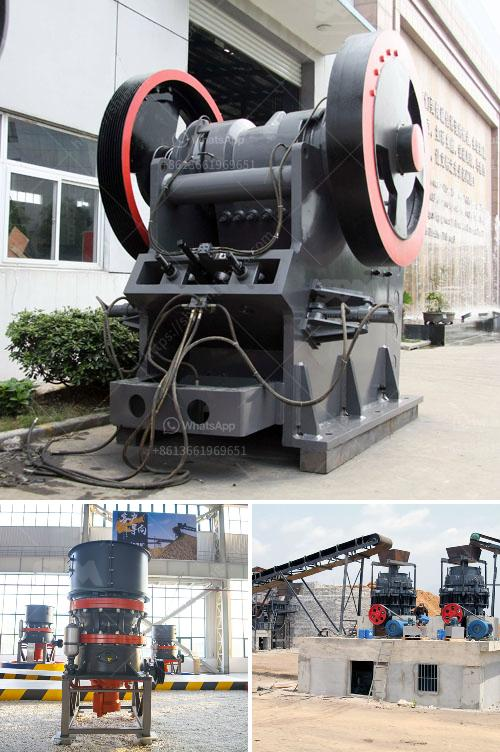

<h3>mobile chrome ore plant</h3>
In the realm of mining operations, the pursuit of efficiency and flexibility has always been a top priority. With the evolution of technology, mobile plants have emerged as a game-changer in the mining industry. A mobile chrome ore plant is a shining example of this innovation, offering an efficient and flexible solution for chrome ore mining operations.

Traditionally, chrome ore plants were established in fixed locations near the mines. However, the advent of mobile plants has redefined the landscape of chrome ore operations. These portable units can be easily transported to different mining sites, enabling miners to extract chrome ore wherever it is found, without the need for costly infrastructure and transportation.

One of the key advantages of a mobile chrome ore plant is its agility. Traditional plants have a fixed infrastructure, which limits their ability to adapt to changing mining conditions. In contrast, a mobile plant can be easily relocated to focus on areas with higher ore grades or move away from depleted mining sites. This flexibility allows mining companies to optimize their operations, maximizing the recovery of valuable chrome ore.

Efficiency is another crucial aspect of mobile chrome ore plants. These units are specifically designed to streamline the production process, ensuring a seamless flow from extraction to processing. With onsite crushers, screeners, and washers, the ore can be transformed into desired grades without the need for additional transportation to fixed plants. This eliminates time-consuming logistical challenges and brings significant cost savings to mining companies.

Furthermore, mobile chrome ore plants often come equipped with advanced automation systems. These sophisticated systems monitor and control the entire process, increasing accuracy, reducing human errors, and minimizing downtime. Additionally, automation ensures compliance with environmental and safety regulations, promoting sustainable and responsible mining practices.

The compact size of mobile plants is yet another advantage. They can be easily transported within standard shipping containers or on trailers, eliminating the need for oversized equipment transportation. This not only allows for cost-effective logistics but also reduces the carbon footprint associated with mining operations. Mobile chrome ore plants promote a more sustainable approach to mining, where resources are utilized efficiently and environmental impacts are minimized.

In summary, mobile chrome ore plants have revolutionized the mining industry by enhancing operational efficiency and flexibility. Their agility allows for rapid adaptation to changing ore grades and geological conditions, maximizing the recovery of valuable chrome ore. Moreover, the compact size and advanced automation systems ensure cost-effective and sustainable mining operations. As technology continues to evolve, mobile plants are poised to play an even more significant role in the future of mining.
<h3>Contact us</h3><ul><li><strong>Whatsapp:&nbsp;<a href="https://wa.me/8613661969651">+8613661969651</a></strong></li><li><a href="https://swt.shibang-china.com/?git&amp;zhl&amp;mobile chrome ore plant"><strong>Online Service(chat now)</strong></a></li></ul><h3>Related</h3><ul><li><a href='hammer mill for plants.md'>hammer mill for plants</a></li><li><a href='construction of a clinker plant.md'>construction of a clinker plant</a></li><li><a href='mining equipment tanzania.md'>mining equipment tanzania</a></li><li><a href='grinding crushing mill brick.md'>grinding crushing mill brick</a></li><li><a href='mobile crushing price uk.md'>mobile crushing price uk</a></li></ul>