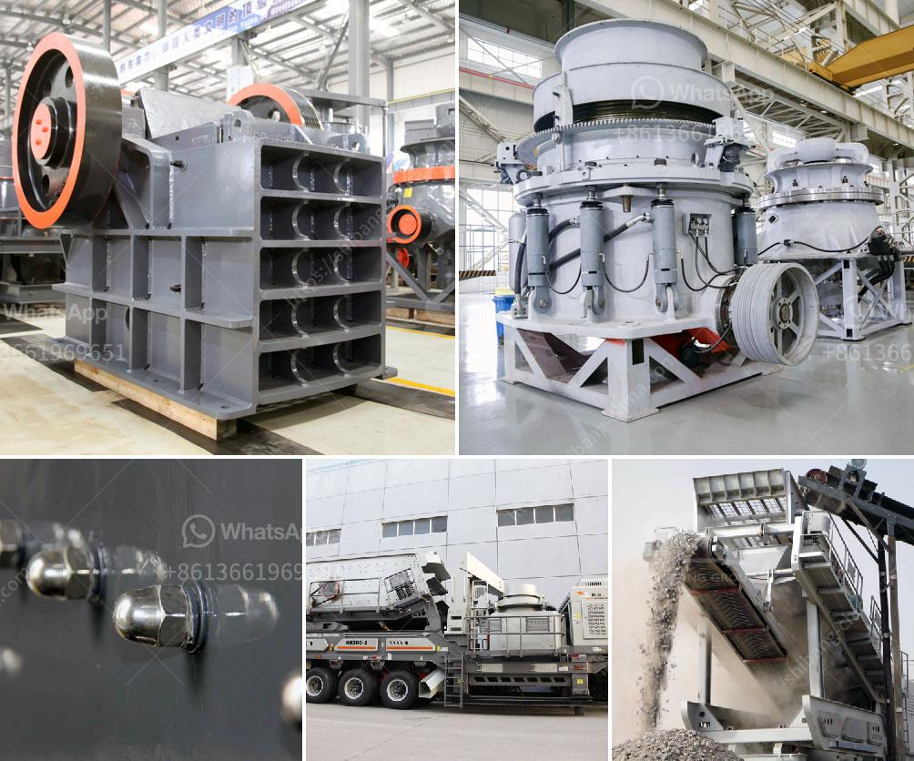

<h3>mobile coal crusher in philippines</h3>
Mobile coal crusher is a new dedicated equipment according to the status of coal mining industry. High efficiency and low consumption is its notable features. Large coal semi-mobile crushing plants are designed to be at the forefront of the coal mining industry, use the most advanced technology and equipment. It ensures arge capacity and high efficiency coal crushing line.

The mobile coal crusher is equipped with a crusher with a large crushing ratio, high efficiency, and low energy consumption. The mobile coal crusher is equipped with vibrating feeder and vibrating screen, which can achieve the coarse and medium crushing and screening effects. Lots of mining equipment suppliers are also responsible for the installation and maintenance of these machines.

As coal is an important energy source for the economic development of the Philippines, the country's coal mining industry plays a vital role in the nation's development. In recent years, the Philippines has adopted an increasingly open attitude towards the coal mining industry. Currently, the government allows large-scale coal mining but strictly regulates the mining methods and utilities. Coal remains a prominent energy source in the Philippines, especially for power generation.

With the rapid development of the construction industry, the demand for coal is constantly expanding. Coal mining companies continue to invest in new coal mines and expand existing coal mines to meet this demand. As a result, the demand for mobile coal crushers is increasing, and there are a wide range of mobile coal crusher models available in the market. The rise of the construction industry is also driving the growth of the mobile coal crusher market.

However, the volatile coal prices and environmental concerns have raised challenges for the coal mining industry in the Philippines. The use of mobile coal crushers is still relatively new, and the market is still in its infancy. There are still many factors that need to be considered before investing in mobile coal crushers. However, with the government's open attitude towards coal mining, the future of the mobile coal crusher market in the Philippines looks promising.
<h3>Contact us</h3><ul><li><strong>Whatsapp:&nbsp;<a href="https://wa.me/8613661969651">+8613661969651</a></strong></li><li><a href="https://swt.shibang-china.com/?git&amp;zhl&amp;mobile coal crusher in philippines"><strong>Online Service(chat now)</strong></a></li></ul><h3>Related</h3><ul><li><a href='mini copper ore extraction plant.md'>mini copper ore extraction plant</a></li><li><a href='portable rock crusher machine.md'>portable rock crusher machine</a></li><li><a href='roller crusher equipment manufacturer.md'>roller crusher equipment manufacturer</a></li><li><a href='construction material recycling technology.md'>construction material recycling technology</a></li><li><a href='diamond river mining equipment in china.md'>diamond river mining equipment in china</a></li></ul>