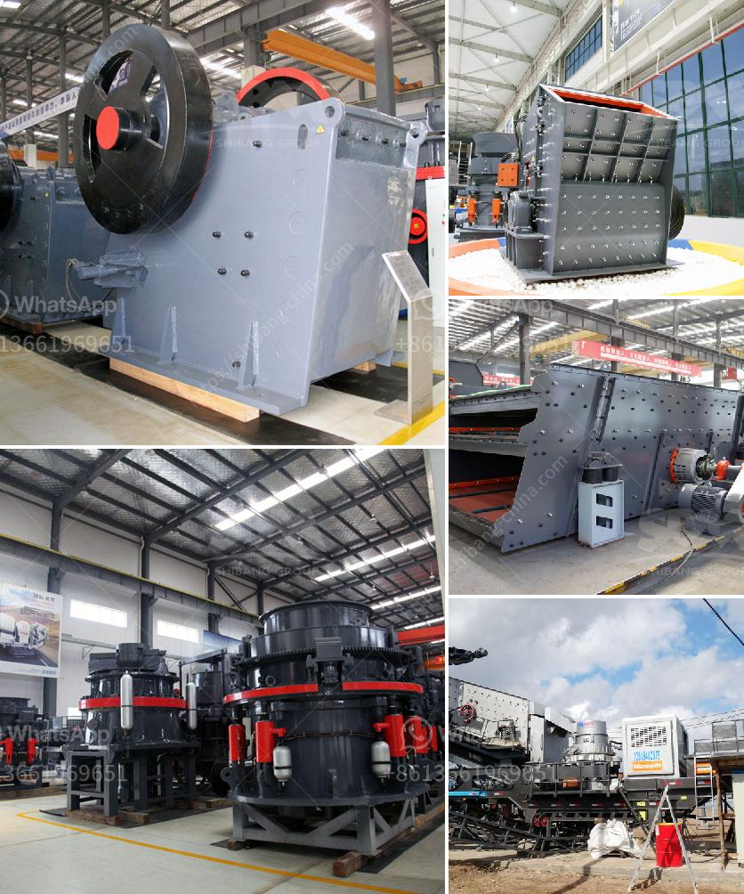

<h3>mobile concrete crusher trailer mounted</h3>
In recent years, the mobile crushing and screening industry has become one of the most booming sectors in the construction industry. With the rise in resource depletion and the increasing demand for raw materials, traditional mining methods have become costly and environmentally damaging. This has led to the development of mobile crushing and screening equipment, which allows construction waste and natural resources to be recycled and reused efficiently. One particular innovation in this field is the mobile concrete crusher trailer mounted.

A mobile concrete crusher trailer mounted, also known as a portable concrete crushing machine, takes the concept of recycling and crushing to a whole new level. It is designed to efficiently eliminate waste by crushing debris such as concrete, tiles, bricks, ceramics, and asphalt. This mobile equipment can be transported to any construction site using a trailer, making it versatile and easily adaptable to different project requirements.

One of the primary advantages of a mobile concrete crusher trailer mounted is its flexibility and mobility. Unlike traditional crushing equipment, which requires a stationary foundation, a trailer-mounted crusher can be easily moved from one location to another. This is particularly advantageous for projects with multiple work sites or for contractors who need to travel frequently. The ability to relocate the equipment reduces transportation costs and allows for maximum utilization of resources.

Another key feature of a mobile concrete crusher trailer mounted is its ability to process various types of materials. This versatility makes it suitable for a wide range of applications, including residential and commercial construction, demolitions, road and bridge construction, and recycling projects. The crusher can handle different sizes of materials, ranging from large chunks to fine aggregates, ensuring that no material goes to waste.

The mobile concrete crusher trailer mounted also offers high efficiency and productivity. Equipped with state-of-the-art technology, it can crush concrete at a rapid rate, significantly reducing the time required for site preparation. This translates into cost savings for contractors and faster project completion times. Additionally, the machine includes advanced features such as dust suppression systems, remote control operation, and user-friendly interfaces, enhancing operator safety and convenience.

Moreover, a mobile concrete crusher trailer mounted is both environmentally friendly and sustainable. By recycling concrete waste, for instance, it helps reduce the need for extracting and processing natural aggregates, which consume significant amounts of energy and water. Additionally, crushing and reusing concrete lowers construction emissions and minimizes landfill usage, contributing to a cleaner and greener environment.

In conclusion, the mobile concrete crusher trailer mounted represents a game-changer in the crushing and screening industry. Its versatility, portability, and efficiency make it an ideal solution for resource recycling and waste reduction. With the ability to process various materials and the flexibility to be relocated, it offers numerous benefits to construction companies, contractors, and the environment as a whole. Embracing this innovative technology will undoubtedly lead to more sustainable and cost-effective construction practices.
<h3>Contact us</h3><ul><li><strong>Whatsapp:&nbsp;<a href="https://wa.me/8613661969651">+8613661969651</a></strong></li><li><a href="https://swt.shibang-china.com/?git&amp;zhl&amp;mobile concrete crusher trailer mounted"><strong>Online Service(chat now)</strong></a></li></ul><h3>Related</h3><ul><li><a href='ultra fine milling machines.md'>ultra fine milling machines</a></li><li><a href='limestone impact mill price.md'>limestone impact mill price</a></li><li><a href='gold ore rock processing equipment price.md'>gold ore rock processing equipment price</a></li><li><a href='ball mill china making.md'>ball mill china making</a></li><li><a href='used raymond mill for sale.md'>used raymond mill for sale</a></li></ul>