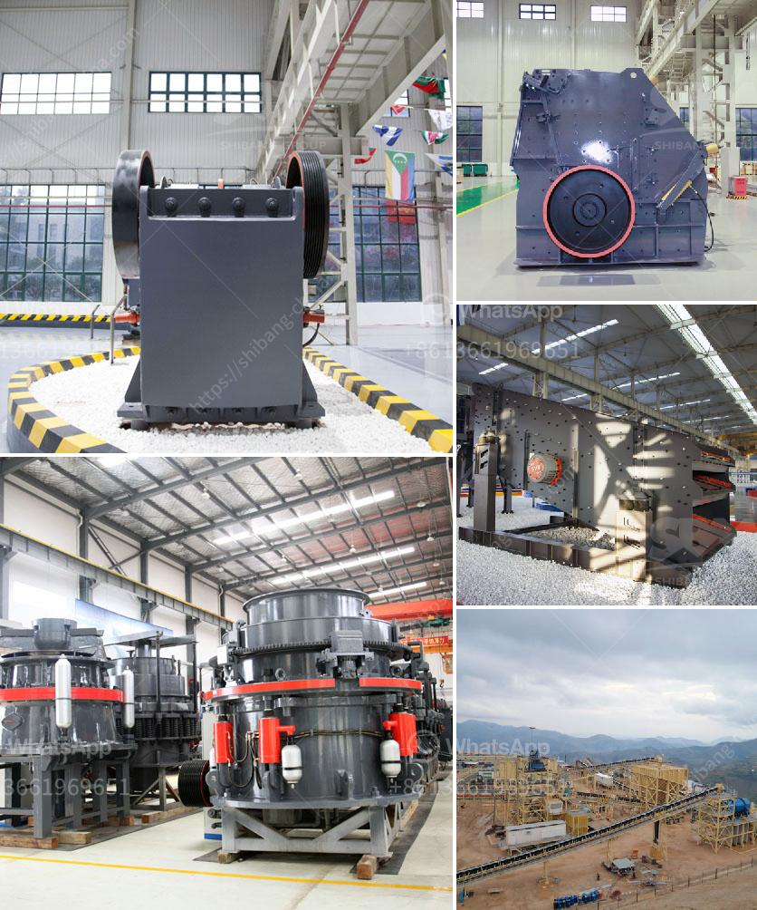

<h3>mobile copper ore shaking table</h3>
Mobile copper ore shaking tables are an innovative solution in the mining industry to efficiently separate and recover valuable copper particles from low-grade ores. This portable equipment has become a game-changer for many small-scale mining operations, offering them an affordable and environmentally-friendly method to increase their copper yield.

Traditionally, copper ore shaking tables were stationary and required a significant amount of space and infrastructure, making them unsuitable for mobile applications. However, advancements in technology have led to the development of compact and portable shaking tables that can be easily transported to remote mining sites.

The mobile copper ore shaking table works on the principles of density separation, utilizing the difference in specific gravities between copper particles and gangue materials. As the table vibrates, water is added to create a fluidized bed, allowing heavier copper particles to settle at the bottom while the lighter gangue materials are carried away by the water flow.

One of the key advantages of a mobile shaking table is its versatility. It can be used on various mining sites, regardless of their location or infrastructure limitations. This flexibility enables miners to access previously untapped resources and increase their copper production, leading to improved economic returns.

Furthermore, the mobile shaking table offers environmental benefits compared to other conventional copper recovery methods. Its low energy consumption and water requirements make it a sustainable alternative, reducing the mining industry's overall environmental impact. Additionally, the technology minimizes the release of harmful chemicals and tailings into the surrounding environment, ensuring the protection of ecosystems and local communities.

In conclusion, the introduction of mobile copper ore shaking tables has revolutionized the mining industry, particularly for small-scale operations. Its portability, efficiency, and environmentally-friendly attributes make it an attractive option to improve copper recovery rates. As technology continues to advance, we can expect further refinements and enhancements in mobile shaking table designs, further optimizing the extraction process and contributing to sustainable mining practices.
<h3>Contact us</h3><ul><li><strong>Whatsapp:&nbsp;<a href="https://wa.me/8613661969651">+8613661969651</a></strong></li><li><a href="https://swt.shibang-china.com/?git&amp;zhl&amp;mobile copper ore shaking table"><strong>Online Service(chat now)</strong></a></li></ul><h3>Related</h3><ul><li><a href='iron ore processing plant in mexico.md'>iron ore processing plant in mexico</a></li><li><a href='portable crushing plants for sale western cape.md'>portable crushing plants for sale western cape</a></li><li><a href='calcium processing plant.md'>calcium processing plant</a></li><li><a href='china clay grinding mill.md'>china clay grinding mill</a></li><li><a href='aluminum slag processing plant in germany.md'>aluminum slag processing plant in germany</a></li></ul>