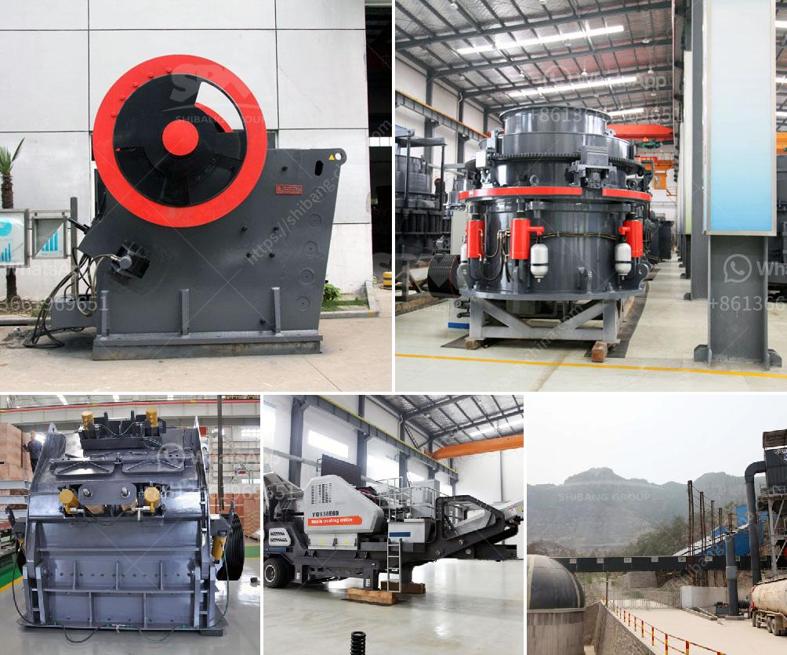

<h3>mobile crusher for sale in philippines</h3>
Mobile crusher, also known as a mobile crushing plant, is a piece of equipment that uses mechanical energy to break rocks into small pieces. This mobile crushing plant equipment can process materials on-site, which greatly reduces the transportation cost. It is widely used in mining, metallurgy, building materials, construction waste treatment, and other industries.

The mobile crusher for sale in the Philippines has a wide range of applications. It can be used to crush various types of rock, such as limestone, marble, granite, basalt, river pebbles, etc. It can also be used for producing aggregates and artificial sand. With the powerful function, good crushing effect and reasonable price, the mobile crusher for sale in the Philippines is widely used in the mining industry. And it is well-received by customers due to its high mobility and convenient operation.

One of the main features of a mobile crusher plant is its mobility. It can move freely within the construction site or within a quarry site. It greatly saves the transportation cost of raw materials. Besides, the mobile crusher can process different materials on site, which avoids the unnecessary step of transporting materials back and forth. This not only saves time but also reduces production costs.

Another advantage of the mobile crusher is its flexibility. Different types of mobile crushers can be combined according to different process requirements, making it more adaptable to different working conditions. For example, a mobile jaw crusher combined with a mobile cone crusher can effectively break large pieces of rock into smaller sizes. This combination is suitable for processing materials with different hardness and different requirements for the finished product.

A mobile crusher plant also has many other advantages. For example, it can be used to directly crush materials on site, eliminating the need to move the materials to a specific site for crushing. In addition, it can be equipped with various types of crushers, such as impact crushers, jaw crushers, cone crushers, and so on, according to different crushing requirements. This not only increases the flexibility of the machine but also improves its crushing capacity and efficiency.

When looking for a mobile crusher for sale in the Philippines, it is important to choose a reliable and reputable supplier. The price and quality of the equipment are important considerations. You should compare different suppliers and choose the one that offers the best value for your money. It is also advisable to visit the supplier's production site to inspect the equipment and check its performance.

Overall, a mobile crusher for sale in the Philippines is a beneficial addition to any construction site or mining operation. It offers flexibility, efficiency, and cost savings. With its wide range of applications and strong adaptability, it is a powerful tool for crushing rocks and producing aggregates. If you are in need of a mobile crusher, consider the Philippines market, and choose a trustworthy supplier to ensure the quality of the equipment.
<h3>Contact us</h3><ul><li><strong>Whatsapp:&nbsp;<a href="https://wa.me/8613661969651">+8613661969651</a></strong></li><li><a href="https://swt.shibang-china.com/?git&amp;zhl&amp;mobile crusher for sale in philippines"><strong>Online Service(chat now)</strong></a></li></ul><h3>Related</h3><ul><li><a href='conveyor belt supplier in china.md'>conveyor belt supplier in china</a></li><li><a href='construction debris recycling.md'>construction debris recycling</a></li><li><a href='crusher materials cone crusher mining.md'>crusher materials cone crusher mining</a></li><li><a href='stone crusher price.md'>stone crusher price</a></li><li><a href='powder making machine price in pakistan.md'>powder making machine price in pakistan</a></li></ul>