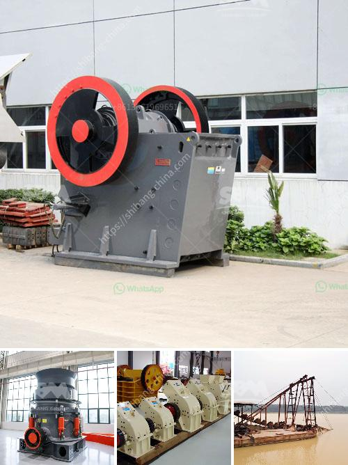

<h3>mobile crusher machine in iran</h3>
Mobile crusher machine in Iran is renowned for its excellent performance and reliability and is ideal for maintaining and servicing heavy-duty road networks. Mobile crusher machine in Iran possesses a feature of advanced structure and reliable operation, easy maintenance and low operating cost. This machine is facilitated with unique dustproof and sealing structure, so that it can effectively control dust and noise pollution and achieve environmental protection.

Mobile crusher machine in Iran can be easily moved from one location to another and therefore flexibility and convenience is ahead by choosing mobile crushers for sale from Iran. This demonstrates the flexibility inherent in the range of mobile crusher machine in Iran. For instance, when working in a construction and demolition site, operators can easily move their machines to the material's location and start processing accordingly, thus saving a great deal of time and effort.

Furthermore, a mobile crusher machine in Iran can be tailored to fit a specific application. With a compact structure and lightweight design, this machine is equipped with a screen that can rotate 360 degrees, resulting in increased maneuverability and efficiency. This machine is also equipped with an onboard integrated system that allows for easy and quick setup and commissioning.

Moreover, mobile crusher machine in Iran can also be designed with a separate and adjustable vibrating screen deck for classifying oversize materials. This feature is particularly useful when the goal is to produce clean, high-quality aggregate for concrete and asphalt production.

Mobile crusher machine in Iran has the advantages of easy transportation, low transportation cost, flexible configuration, convenient maintenance, etc. Iran has a large number of quarries and the size of these quarries is expanding rapidly. In order to meet modern construction requirements, contractors and road builders need efficient equipment to complete their job tasks. The availability of mobile crusher machine in Iran has helped contractors to recycle asphalt, stone, concrete, and other materials effectively, reducing the need for new materials.

Mobile crusher machine in Iran for sale has been the main investing target for mining investors, especially in the large-scale and established market. Iran is the second largest producer of crude oil in the OPEC and is the 7th largest producer of oil gas and petroleum in the world. However, petroleum and petroleum-based products account for most of Iran's revenue from exports. Therefore, developing the mining industry is a priority in Iran and the government is seeking to attract foreign investment.

In conclusion, mobile crusher machine in Iran is adaptable to all mobile crushing needs. It sets up a new range of business opportunities for contractors, quarry operators, recycling and mining applications. The mobile crusher machine in Iran includes mobile jaw crusher, mobile cone crusher, mobile impact crusher, mobile VSI crusher and mobile screening plant, which is suitable for even the most challenging conditions.
<h3>Contact us</h3><ul><li><strong>Whatsapp:&nbsp;<a href="https://wa.me/8613661969651">+8613661969651</a></strong></li><li><a href="https://swt.shibang-china.com/?git&amp;zhl&amp;mobile crusher machine in iran"><strong>Online Service(chat now)</strong></a></li></ul><h3>Related</h3><ul><li><a href='jaw crusher baxter.md'>jaw crusher baxter</a></li><li><a href='aggregates crusher philippines.md'>aggregates crusher philippines</a></li><li><a href='3 tom capecity ball mill.md'>3 tom capecity ball mill</a></li><li><a href='crushers for rent cincinnati.md'>crushers for rent cincinnati</a></li><li><a href='pulverizer crusher manufacturer in chennai.md'>pulverizer crusher manufacturer in chennai</a></li></ul>