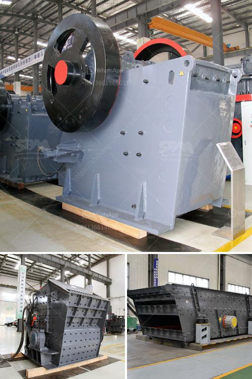

<h3>mobile crusher machine manufacturer</h3>
A mobile crusher machine is a powerful and efficient tool designed to promote recycling, processing, and waste reduction in a wide range of industries. Today, mobile crusher machines have compact structure, high production efficiency, and mobility for various crushing operations. Mobile crushing machines are widely utilized in the mining industry, construction material, metallurgy, chemical industry, and many other fields.

One of the leading mobile crusher machine manufacturers is located in China. They have been providing high-quality equipment for a variety of industries since several years. The company offers a wide range of mobile crushing and screening machines, such as jaw crushers, impact crushers, cone crushers, and multi-deck inclined screens. Their machines are designed to process different types of materials, from granite to limestone, asphalt to concrete, and many others.

The mobile crusher machines from this manufacturer are designed for high-performance applications. They are capable of crushing various materials of different hardness levels. The machines can produce the desired particle size and shape according to the specific needs of the customers. The mobile crusher machines are equipped with advanced technologies and intelligent control systems, ensuring efficient and reliable operation.

Additionally, this manufacturer offers customized solutions to meet the specific requirements of clients. They have a team of experienced engineers and technicians who can design and manufacture mobile crusher machines according to customer specifications. This flexibility allows customers to have machines tailored to their exact needs, resulting in increased productivity and cost efficiency.

The mobile crusher machines manufactured by this company are also known for their low maintenance and operational costs. The machines are designed to be user-friendly, making maintenance tasks simple and time-saving. Furthermore, the company provides comprehensive after-sales service and technical support, ensuring smooth operation of the machines throughout their lifetime.

Environmental sustainability is another key focus of this mobile crusher machine manufacturer. Their machines are designed to minimize environmental impact and promote resource conservation. For instance, the machines are equipped with dust suppression systems to minimize dust emissions during operation. They are also designed to consume less energy, reduce noise pollution, and minimize waste generation.

Apart from providing high-quality mobile crusher machines, this manufacturer also offers reliable spare parts and wear-resistant components. They understand that regular maintenance and replacement of parts are crucial for the continuous and efficient operation of the machines. Therefore, they maintain a significant inventory of spare parts and provide fast and reliable delivery services to all their customers.

In conclusion, this mobile crusher machine manufacturer is dedicated to providing high-quality equipment, customized solutions, and excellent after-sales service. They have a strong focus on efficiency, durability, environmental sustainability, and customer satisfaction. With their advanced technologies and extensive experience, they have gained a reputable position in the industry. Choosing mobile crusher machines from this manufacturer ensures superior performance, reduced costs, and increased profitability for businesses in various sectors.
<h3>Contact us</h3><ul><li><strong>Whatsapp:&nbsp;<a href="https://wa.me/8613661969651">+8613661969651</a></strong></li><li><a href="https://swt.shibang-china.com/?git&amp;zhl&amp;mobile crusher machine manufacturer"><strong>Online Service(chat now)</strong></a></li></ul><h3>Related</h3><ul><li><a href='roller mill for ares.md'>roller mill for ares</a></li><li><a href='germany standard pyrophyllite powder grinding mill.md'>germany standard pyrophyllite powder grinding mill</a></li><li><a href='ballast crusher for sale.md'>ballast crusher for sale</a></li><li><a href='barite ore processing equipment rent and sale.md'>barite ore processing equipment rent and sale</a></li><li><a href='lime plant manufacturer in turkey.md'>lime plant manufacturer in turkey</a></li></ul>