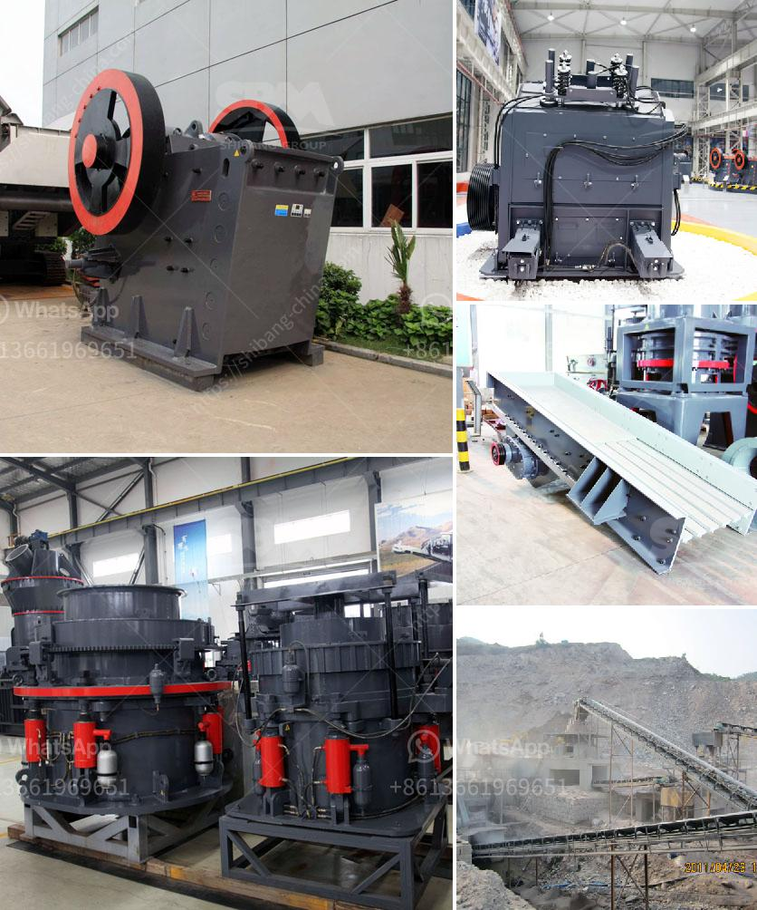

<h3>mobile crusher stone</h3>
Mobile crushers have become immensely popular in the last few years due to their versatility and ease of use. These machines can be easily transported from one job site to another, making them highly efficient at performing various tasks.

One of the most popular types of mobile crushers is the stone crusher. It allows for crushing rocks, gravel, and other materials quickly and effortlessly. Mobile crushers have revolutionized the way materials like stone are crushed, simplifying the process and saving on transportation costs.

The mobile crusher allows for the crushing operation to be performed directly on-site, reducing the need for transporting materials from the project site to a stationary crusher. This greatly reduces transportation costs and allows for higher production rates.

Another advantage of mobile crushers is their flexibility in terms of customization. Each mobile crusher can be adapted to suit various crushing applications. This versatility ensures that the machine can be used in different industries, including construction, mining, and recycling.

Additionally, mobile crushers enhance safety on construction sites. With the ability to crush materials directly on-site, the risk of accidents during transportation is minimized. The machine can be operated by a single person, eliminating the need for additional manpower, which further reduces costs for companies.

In conclusion, mobile stone crushers have revolutionized the construction industry as they provide flexibility and cost efficiency. With the ability to handle various types of materials, these machines enable safe and efficient crushing operations directly on-site. It's no wonder why mobile crushers have become a popular choice among construction companies worldwide.
<h3>Contact us</h3><ul><li><strong>Whatsapp:&nbsp;<a href="https://wa.me/8613661969651">+8613661969651</a></strong></li><li><a href="https://swt.shibang-china.com/?git&amp;zhl&amp;mobile crusher stone"><strong>Online Service(chat now)</strong></a></li></ul><h3>Related</h3><ul><li><a href='construction of a clinker plant.md'>construction of a clinker plant</a></li><li><a href='stone crushing system.md'>stone crushing system</a></li><li><a href='dense medium separation equipment supplier.md'>dense medium separation equipment supplier</a></li><li><a href='stone crusher plant kyc.md'>stone crusher plant kyc</a></li><li><a href='machine that to crush rock.md'>machine that to crush rock</a></li></ul>