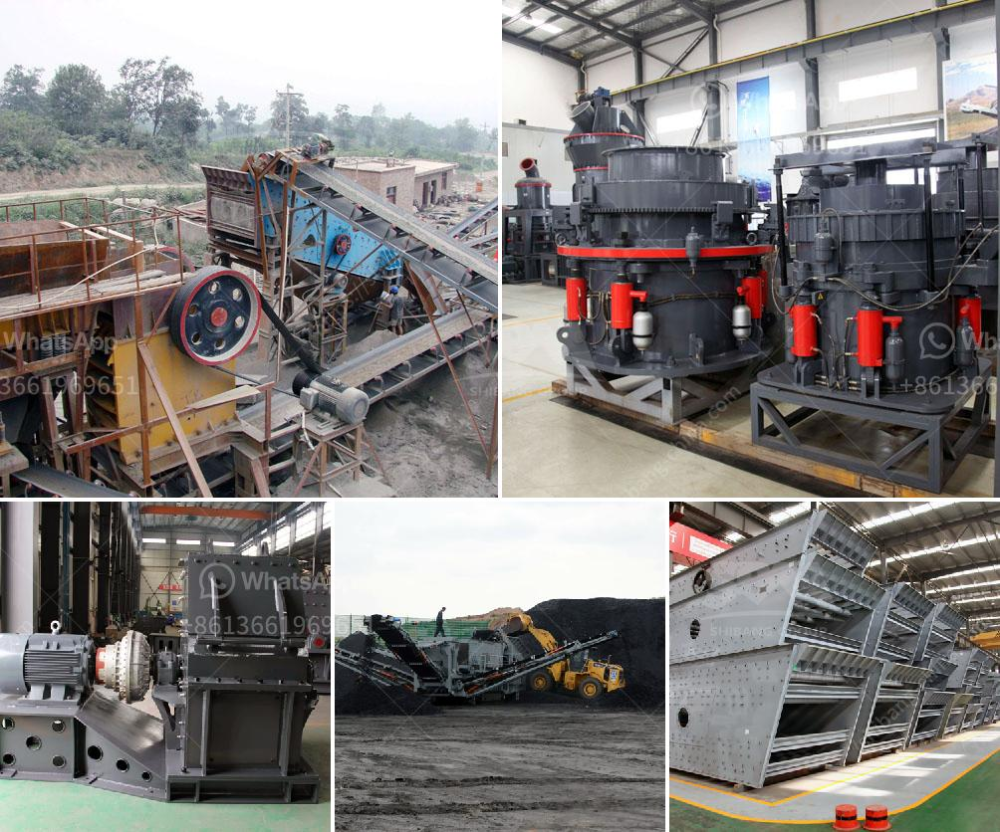

<h3>mobile crusher supplier</h3>
In today's fast-paced world, the need for advanced technology is at an all-time high. One of the most significant technological advancements in recent years is the mobile crusher. This innovative equipment has revolutionized the construction and mining industries by providing efficient and convenient solutions for on-site crushing and screening operations. With the rising demand for aggregates and various other materials, the role of mobile crusher suppliers has become more crucial than ever.

A mobile crusher is a machine designed to reduce large rocks into smaller rocks, gravel, or rock dust. It utilizes a mobile wheel-mounted chassis which can be easily transported from one location to another. This mobility allows the crusher to tackle diverse processing tasks, such as the crushing of asphalt, concrete, and natural rock. Mobile crushers are typically used in construction sites, quarries, and mining operations to crush materials directly at the source, reducing transportation costs and ensuring a steady supply of materials for further processing.

Choosing a reliable mobile crusher supplier is of utmost importance to ensure that the equipment meets the required specifications and provides optimal performance. There are several key factors to consider when selecting a supplier. Firstly, the supplier should have a strong track record of delivering high-quality equipment that is built to last. This can be gauged by assessing customer reviews and reputation within the industry. Additionally, the supplier should offer a wide range of mobile crushers to meet the specific needs and requirements of different projects.

Furthermore, a reliable supplier should provide excellent after-sales service and support. This includes comprehensive training for operators to ensure safe and efficient operation of the equipment. The supplier should also offer timely maintenance and spare parts support to minimize downtime and maximize productivity. A responsive customer support team that can address any issues or concerns quickly is also crucial for a seamless user experience.

In terms of technological advancements, a reputable mobile crusher supplier should always stay up to date with the latest industry developments. This includes incorporating advanced features and functions in their equipment, such as improved fuel efficiency, enhanced control systems, and remote monitoring capabilities. By staying ahead of the curve, the supplier can offer cutting-edge solutions that cater to the evolving needs of their customers.

The role of the mobile crusher supplier goes beyond just providing equipment. They should also serve as a valuable resource for customers, offering expert advice and guidance on the best practices for crushing and screening operations. This can include tips on material selection, size reduction techniques, and cost-effective solutions for specific projects.

In conclusion, the mobile crusher supplier plays a vital role in meeting the rapidly growing demands of the construction and mining industries. By providing reliable and efficient equipment, along with excellent after-sales support, they contribute to increased productivity, lowered costs, and improved overall operational efficiency. As the industry continues to evolve, mobile crusher suppliers must continually adapt and innovate to stay ahead of the competition and meet the evolving needs of their customers.
<h3>Contact us</h3><ul><li><strong>Whatsapp:&nbsp;<a href="https://wa.me/8613661969651">+8613661969651</a></strong></li><li><a href="https://swt.shibang-china.com/?git&amp;zhl&amp;mobile crusher supplier"><strong>Online Service(chat now)</strong></a></li></ul><h3>Related</h3><ul><li><a href='ultra fine milling machines.md'>ultra fine milling machines</a></li><li><a href='mobile mineral processing gravity plants.md'>mobile mineral processing gravity plants</a></li><li><a href='clay graphite grinding process.md'>clay graphite grinding process</a></li><li><a href='quarry equipment for hire in nigeria.md'>quarry equipment for hire in nigeria</a></li><li><a href='coal crushing and screening plant in south africa.md'>coal crushing and screening plant in south africa</a></li></ul>