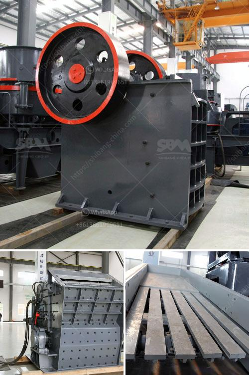

<h3>mobile crusher triman</h3>
Mobile crushers have been used for decades in the mining industry and they are an efficient way to crush rocks and minerals on-the-go. With the development of technology, Triman has made a significant contribution to the improvement of the mobile crusher. This Spanish company offers high-quality machinery for mining and construction sectors. In this article, we will explore the features and benefits of Triman's mobile crusher.

Triman's mobile crusher is a state-of-the-art piece of machinery that combines versatility with durability. It is designed to crush rocks and minerals in a variety of applications, including concrete and asphalt recycling, quarrying, and mining. This machine can efficiently process materials of different sizes and hardness levels, making it suitable for a wide range of projects.

One of the standout features of Triman's mobile crusher is its mobility. It is mounted on tracks, which allows it to easily navigate through rough terrains and tight spaces. This means that it can be used in remote locations and hard-to-reach areas, where traditional crushers would struggle to operate. The ability to move the machine effortlessly from one site to another greatly enhances its effectiveness and efficiency.

Another notable feature is the high crushing capacity of Triman's mobile crusher. With its powerful engine and robust design, it can process large quantities of material in a relatively short time. This reduces downtime and increases the productivity of any project. Additionally, the machine is equipped with a hydraulic system that adjusts the crusher's settings according to the type of material being processed, ensuring optimal performance at all times.

Triman's mobile crusher also prioritizes safety. It is equipped with state-of-the-art safety features, including emergency stop buttons, safety locks, and a user-friendly control panel. These features ensure the safe operation of the machine, protecting the operator and the surrounding environment.

Moreover, Triman's mobile crusher is designed with sustainability in mind. It incorporates advanced technologies that reduce energy consumption and minimize environmental impact. The machine is equipped with a Tier 4 Final engine that meets the strictest emission standards, making it an eco-friendly choice.

In conclusion, Triman's mobile crusher is a reliable and efficient solution for crushing rocks and minerals on-the-go. Its mobility, high crushing capacity, and safety features make it suitable for a variety of projects. Furthermore, its sustainability credentials highlight Triman's commitment to environmental responsibility. Whether it is for recycling, quarrying, or mining, Triman's mobile crusher is a valuable asset that can enhance productivity and efficiency in any operation.
<h3>Contact us</h3><ul><li><strong>Whatsapp:&nbsp;<a href="https://wa.me/8613661969651">+8613661969651</a></strong></li><li><a href="https://swt.shibang-china.com/?git&amp;zhl&amp;mobile crusher triman"><strong>Online Service(chat now)</strong></a></li></ul><h3>Related</h3><ul><li><a href='used raymond mill for sale.md'>used raymond mill for sale</a></li><li><a href='pebble production line.md'>pebble production line</a></li><li><a href='crushers stone crushers price.md'>crushers stone crushers price</a></li><li><a href='grinding mill for sale zimbabwe.md'>grinding mill for sale zimbabwe</a></li><li><a href='hydraulic cone crusher price.md'>hydraulic cone crusher price</a></li></ul>