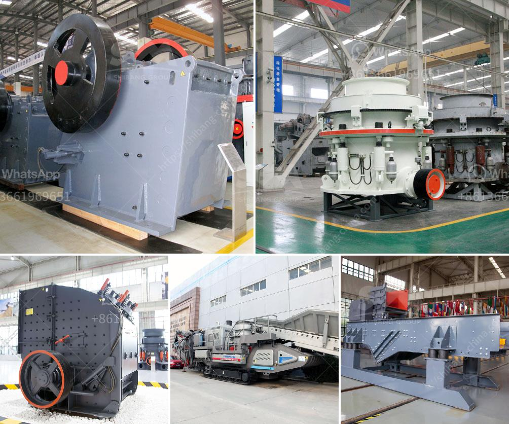

<h3>mobile crusher unit</h3>
With the rapid development of concrete technology, the demand for sand and gravel aggregate has soared, while natural sand resources are becoming scarcer. This has led to a significant increase in the construction waste generated during construction projects. The traditional method of disposing of construction waste not only pollutes the environment but also wastes resources. Consequently, the need for efficient and environmentally friendly construction waste disposal equipment is becoming increasingly urgent.

The mobile crusher unit is the ideal solution for high productivity and low operational costs. It provides a cost-effective solution for materials processing operations in the recycling, quarrying, and mining industries. The mobile crushing unit is equipped with a technologically advanced crushing system that is reliable and efficient. It offers a wide range of crushing options to meet various requirements, such as recycling, quarrying, and mining applications.

One of the key advantages of a mobile crusher unit is its versatility. It can be operated in a single or multi-stage crushing process, depending on the desired end product. This flexibility allows the unit to be used in a wide range of applications, from primary crushing to secondary and tertiary crushing. Additionally, the mobile crusher unit can be easily transported to different sites, making it suitable for both stationary and mobile operations.

The mobile crusher unit features a powerful diesel engine that generates high torque, ensuring efficient crushing performance. It also incorporates advanced crushing technologies, such as the hydraulic system for adjusting the crusher settings and the automatic iron removal system for clearing unwanted metal objects. With these features, the mobile crusher unit guarantees a high level of productivity and minimizes downtime.

Furthermore, the mobile crusher unit is designed to be environmentally friendly. It uses advanced dust suppression systems to minimize dust emission during the crushing process, reducing air pollution and improving the working environment. Additionally, the unit is equipped with a water mist spraying system to further suppress dust and prevent the spread of harmful particles.

In conclusion, the mobile crusher unit is an advanced and efficient solution for the crushing and recycling of construction waste. Its versatility, high productivity, and environmentally friendly design make it an ideal choice for any material processing operation. With its powerful engine and advanced crushing technologies, it guarantees exceptional performance and durability. Whether used in recycling, quarrying, or mining applications, the mobile crusher unit is a cost-effective and reliable solution for all your crushing needs.
<h3>Contact us</h3><ul><li><strong>Whatsapp:&nbsp;<a href="https://wa.me/8613661969651">+8613661969651</a></strong></li><li><a href="https://swt.shibang-china.com/?git&amp;zhl&amp;mobile crusher unit"><strong>Online Service(chat now)</strong></a></li></ul><h3>Related</h3><ul><li><a href='sand manufacturing machine.md'>sand manufacturing machine</a></li><li><a href='rock crushers in china.md'>rock crushers in china</a></li><li><a href='jaw crusher machine for sale.md'>jaw crusher machine for sale</a></li><li><a href='crushing plant for aggregate india.md'>crushing plant for aggregate india</a></li><li><a href='how to start a concrete block business.md'>how to start a concrete block business</a></li></ul>