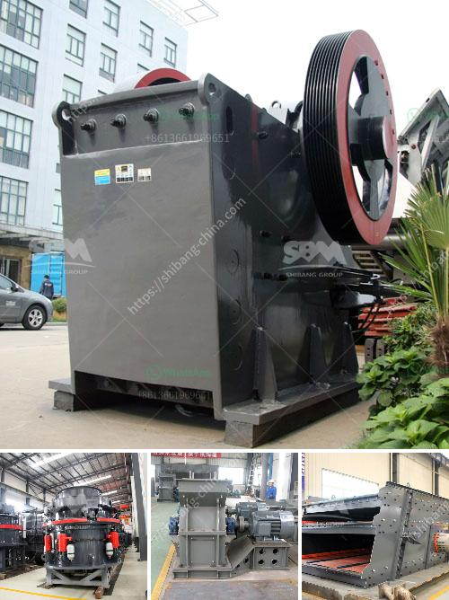

<h3>mobile crushing and screening in malaysia</h3>
Malaysia is experiencing rapid urbanization and industrialization, resulting in increased construction projects and a growing demand for resources. This has led to a surge in the need for mobile crushing and screening equipment, which offers flexibility and efficiency in quarrying, recycling, demolition, and mining operations. Mobile crushing plants provide a convenient and cost-effective solution due to their versatility and ease of transportation.

One advantage of mobile crushers and screens is their ability to move wherever they are needed. This eliminates the need for multiple crushing and screening plants at different locations, reducing transportation costs and saving time. Whether it is gravel, limestone, or granite, these mobile units can process various materials onsite, providing a significant advantage over traditional fixed plants.

In addition to their mobility, mobile crushing and screening plants offer high efficiency and productivity. With advanced technology and innovative features, these machines are capable of crushing and screening large volumes of rock and other materials within a short time frame. Their high crushing capacities ensure that projects are completed in a timely manner, saving costs and meeting deadlines.

Another significant benefit of mobile crushing and screening equipment in Malaysia is their ability to adapt to different job sites. Whether it is a quarry, recycling yard, or demolition site, these machines can handle various types of materials, including concrete, asphalt, and bricks. By processing and recycling these materials onsite, contractors can save on disposal fees and reduce the environmental impact of their operations.

Safety is a top priority in any construction or mining project. Mobile crushing and screening equipment in Malaysia often come with advanced safety features such as remote control systems, which allow operators to maintain a safe distance from the machines during operation. Additionally, automatic overload protection and dust suppression systems help ensure a safe working environment.

The growth of the mobile crushing and screening market in Malaysia is closely linked to the country's infrastructure development. With numerous road projects in progress, there is a constant need for high-quality aggregates. Mobile crushers and screens play a crucial role in supplying the required materials. Furthermore, the increasing focus on sustainable development demands the use of recycled materials, and mobile crushing and screening equipment excel in this area.

To meet the growing demand, manufacturers have been introducing advanced mobile crushing and screening solutions to the Malaysian market. These machines are more energy-efficient, environmentally friendly, and offer better performance compared to their predecessors. Additionally, they are designed to withstand the harsh Malaysian climate and operate in challenging conditions.

In conclusion, mobile crushing and screening plants have become an essential tool for Malaysia's construction industry. The benefits of these machines, such as their mobility, efficiency, adaptability, and safety features, make them a preferred choice for contractors and project developers. With ongoing infrastructure projects and an increasing emphasis on sustainable development, the demand for mobile crushing and screening equipment is only expected to rise.
<h3>Contact us</h3><ul><li><strong>Whatsapp:&nbsp;<a href="https://wa.me/8613661969651">+8613661969651</a></strong></li><li><a href="https://swt.shibang-china.com/?git&amp;zhl&amp;mobile crushing and screening in malaysia"><strong>Online Service(chat now)</strong></a></li></ul><h3>Related</h3><ul><li><a href='cost cone crusher.md'>cost cone crusher</a></li><li><a href='cost of granite crushing equipment.md'>cost of granite crushing equipment</a></li><li><a href='concrete crushing machines.md'>concrete crushing machines</a></li><li><a href='jaw crusher diagram.md'>jaw crusher diagram</a></li><li><a href='mining equipment for hire zimbabwe.md'>mining equipment for hire zimbabwe</a></li></ul>