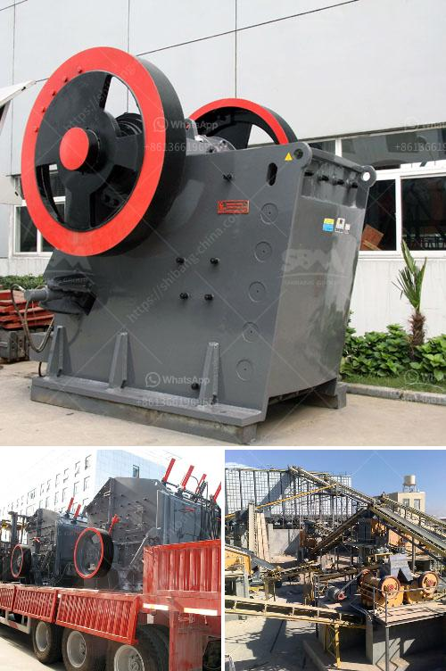

<h3>mobile crushing machine manufacturer</h3>
The construction industry is witnessing a significant surge in demand for construction materials, which has led to an increased need for efficient crushing machines. In this fast-paced world, it is essential to have advanced equipment that can process materials on the go. Mobile crushing machines are the answer to this growing demand.

Mobile crushing machines are a game-changer in the construction industry. They allow contractors to crush materials directly on-site, reducing transportation costs and eliminating the need for additional equipment. These portable crushers are versatile and can be used for various applications, such as recycling concrete, asphalt, and quarrying stone.

One of the key players in the mobile crushing machine industry is the mobile crushing machine manufacturer. These manufacturers are responsible for creating innovative and reliable equipment that can withstand the harsh conditions of construction sites. They invest heavily in research and development to meet the ever-evolving demands of the industry.

A reputable mobile crushing machine manufacturer understands the importance of quality control. They ensure that their machines are built to last with robust materials and advanced technologies. These machines are designed to be user-friendly, making it easy for operators to handle and maintain them.

Mobile crushing machines provide numerous advantages to construction companies. Firstly, they improve productivity by crushing materials directly on-site, saving time and labor. Moreover, these machines can be easily transported from one job site to another, reducing downtime and increasing efficiency.

Another crucial advantage is environmental sustainability. Mobile crushing machines decrease the carbon footprint by eliminating the need for transportation and reducing waste. They also enable recycling of materials, contributing to a circular economy.

Overall, mobile crushing machines have revolutionized the way construction companies operate. They offer convenience, cost-effectiveness, and environmental benefits. When selecting a mobile crushing machine manufacturer, it is crucial to choose a reputable company that prioritizes quality and customer satisfaction. As the demand for construction materials continues to rise, these machines will play an integral role in meeting the industry's needs.
<h3>Contact us</h3><ul><li><strong>Whatsapp:&nbsp;<a href="https://wa.me/8613661969651">+8613661969651</a></strong></li><li><a href="https://swt.shibang-china.com/?git&amp;zhl&amp;mobile crushing machine manufacturer"><strong>Online Service(chat now)</strong></a></li></ul><h3>Related</h3><ul><li><a href='coal powder plant.md'>coal powder plant</a></li><li><a href='ball mill prices and for sale ghana.md'>ball mill prices and for sale ghana</a></li><li><a href='rock crusher suppliers in malaysia.md'>rock crusher suppliers in malaysia</a></li><li><a href='copper slag manufacturing process.md'>copper slag manufacturing process</a></li><li><a href='rubber latex processing ppt.md'>rubber latex processing ppt</a></li></ul>