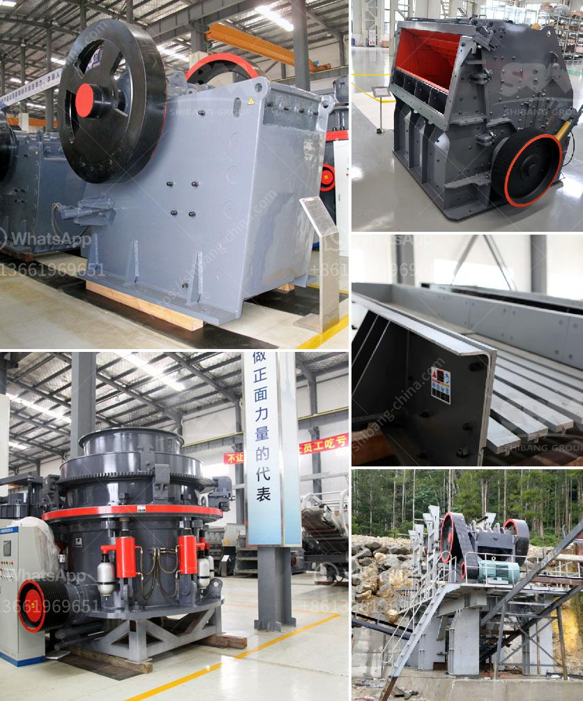

<h3>mobile crushing plant hire product</h3>
As the foundation of a construction project, a mobile crushing plant can be an efficient and convenient way to carry out primary crushing duties. This unit has been specifically designed for onsite processing and quarrying purposes, making it reliable and versatile.

The mobile crushing plant is not limited by the crushing place, and reduces high material transportation cost. It can crush materials on site or working nearly. It is widely used in the industry of mining, metallurgy, building materials, traffic, water conservancy and so on.

When working on a project, the construction site often changes location, and this poses a problem for traditional fixed crushing plants. Transporting materials to the stationary plant is time-consuming and unnecessary. However, a mobile crushing plant eliminates all these obstacles, allowing for crushing jobs to be carried out efficiently and promptly.

One of the great benefits of the mobile crushing plant is that it increases efficiency. No longer will you require hauling trucks, making your project more mobile and allowing for greater flexibility. Moreover, it provides operators with a greater level of comfort, as they no longer need to sit in the cabin of a noisy, vibrating machine.

In addition, the mobile crushing plant is energy-saving and environmentally friendly. It requires less energy to operate, decreasing fuel consumption and lowering greenhouse gas emissions. This makes it an ideal solution for projects aiming to reduce their carbon footprint.

The mobile crushing plant is equipped with an efficient diesel engine that provides quiet, steady operation. This means low fuel consumption, reduced exhaust emission, and low noise levels. Noise and dust pollution are also significantly reduced, making it an ideal solution for environmentally sensitive areas.

Another advantage of the mobile crushing plant is its easy maintenance. It features a strong, durable structure that requires minimal maintenance, saving time and effort for operators. Additionally, the mobile crushing plant is equipped with a user-friendly control panel, making it easy to operate for both skilled personnel and beginners.

The mobile crushing plant is available in different sizes and configurations, giving customers the option to choose the most suitable unit for their needs. It can be used as a standalone crusher or in conjunction with other units as part of a larger plant. This versatility proves to be advantageous for any project, big or small.

In conclusion, a mobile crushing plant hire is an ideal solution for operators that require on-the-spot crushing without being hindered by any restrictions. The mobile crushing plant hire can be tailored to suit each specific contract crushing need, drawing upon decades of expertise and a wide range of crushers, screens, and crushing plants to achieve the right product for the client's specific conditions.

With a strong track record of safety and performance, the mobile crushing plant hire is readily available to help optimize the client’s productivity and maximize their return on investment. Whether it's recycling concrete or crushing rocks, the mobile crushing plant hire can tackle any crushing job efficiently and effectively.
<h3>Contact us</h3><ul><li><strong>Whatsapp:&nbsp;<a href="https://wa.me/8613661969651">+8613661969651</a></strong></li><li><a href="https://swt.shibang-china.com/?git&amp;zhl&amp;mobile crushing plant hire product"><strong>Online Service(chat now)</strong></a></li></ul><h3>Related</h3><ul><li><a href='hammer mills for limestone.md'>hammer mills for limestone</a></li><li><a href='sand crushing and screening hire.md'>sand crushing and screening hire</a></li><li><a href='schredder and grinding mille for sale.md'>schredder and grinding mille for sale</a></li><li><a href='iron crushing plant.md'>iron crushing plant</a></li><li><a href='gypsum production plant.md'>gypsum production plant</a></li></ul>