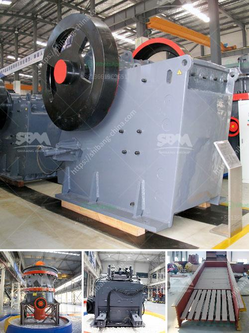

<h3>mobile crushing price uk</h3>
Mobile crushing has become popular in the construction industry due to its convenience and efficiency. It offers contractors the opportunity to crush materials directly on-site, eliminating the need for transportation and reducing costs. In the UK, mobile crushing prices are determined by various factors such as the type of equipment, the level of customization, and the volume of materials to be processed.

One of the main advantages of mobile crushing is the flexibility it provides. Contractors can easily move the equipment from one site to another, allowing them to take on multiple projects simultaneously. This not only saves time but also enables contractors to access hard-to-reach areas that traditional crushing equipment cannot reach.

The price of mobile crushing equipment in the UK varies depending on the type of machine. Jaw crushers, cone crushers, and impact crushers are some of the most commonly used equipment for crushing materials. Each type has its own specifications and capabilities, which determine its price range. Additionally, the level of customization required can also affect the overall cost. Some contractors may require additional features or modifications to suit their specific needs, which can increase the price.

Another factor that influences mobile crushing prices is the volume of materials to be processed. The higher the volume, the more expensive the equipment and operation costs are likely to be. However, processing larger volumes can also lead to economies of scale, as contractors can benefit from bulk discounts and increase their profitability.

Moreover, the prices can also depend on the duration of the mobile crushing project. Longer-term projects may require rental agreements or lease contracts, which can affect overall pricing.

In conclusion, mobile crushing is a cost-effective solution for contractors in the UK. The price range is influenced by factors such as the type of equipment, level of customization, volume of materials, and project duration. By investing in mobile crushing, contractors can benefit from increased efficiency, reduced transportation costs, and the ability to take on multiple projects simultaneously.
<h3>Contact us</h3><ul><li><strong>Whatsapp:&nbsp;<a href="https://wa.me/8613661969651">+8613661969651</a></strong></li><li><a href="https://swt.shibang-china.com/?git&amp;zhl&amp;mobile crushing price uk"><strong>Online Service(chat now)</strong></a></li></ul><h3>Related</h3><ul><li><a href='100tpd cement plant cost in india.md'>100tpd cement plant cost in india</a></li><li><a href='three ring micro powder mill.md'>three ring micro powder mill</a></li><li><a href='small stone crusher machine.md'>small stone crusher machine</a></li><li><a href='vail crushing meachine models in pharma.md'>vail crushing meachine models in pharma</a></li><li><a href='calcium carbonate powder mill price.md'>calcium carbonate powder mill price</a></li></ul>