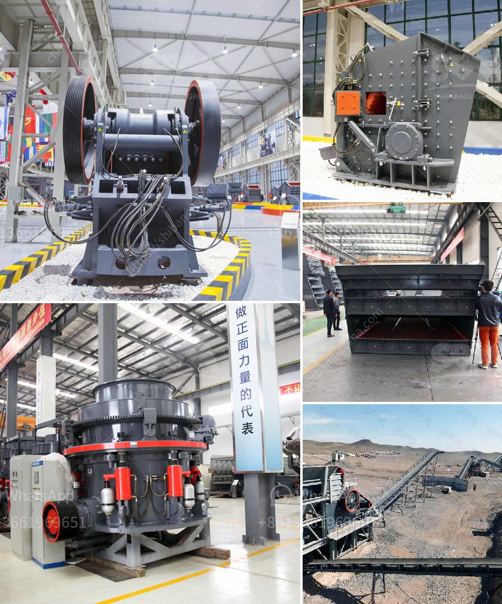

<h3>mobile crushing price</h3>
In today's fast-paced world, the construction industry is constantly challenged to find innovative and cost-effective solutions to meet project deadlines and stay within budget. One such solution that has gained significant popularity in recent years is mobile crushing.

Mobile crushing refers to the process of reducing large rocks into smaller particles by using crushers. This method of rock crushing allows contractors to save on transportation costs and brings the crushing operation to the construction site, eliminating the need to haul aggregates from a distant quarry.

When it comes to mobile crushing price, there are several factors to consider. The prices can vary based on different aspects, including the type of crusher, capacity, and additional features. However, the general price range for a mobile crushing plant with a capacity of 100 to 200 tons per hour is around $300,000 to $800,000. For higher capacity plants or those with special features, prices can go up to $1 million or more. It is essential to note that these prices are approximate and can fluctuate depending on market conditions and individual supplier policies.

One of the primary reasons why mobile crushing has become a preferred choice for contractors is its cost-effectiveness. Traditional methods of rock crushing involve transporting the material to a fixed location, which often leads to increased transportation costs and lengthens project timelines. On the other hand, mobile crushing eliminates the need for transportation, as the equipment can be moved from one site to another, reducing costs significantly.

Furthermore, mobile crushing offers greater flexibility in terms of selecting suitable locations for crushing operations. Contractors can set up the crushing plant at the construction site, ensuring immediate access to the required aggregates, reducing delays caused by transportation and improving overall efficiency. This flexibility is particularly beneficial for projects in remote or difficult-to-access areas.

Another significant advantage of mobile crushing is its environmental impact. With the increasing emphasis on sustainable construction practices, contractors are continually seeking methods that minimize their carbon footprint. By crushing rocks on-site, mobile crushing reduces the need for trucks and decreases greenhouse gas emissions associated with transportation. Additionally, it eliminates the need for the reclamation of mined areas, further contributing to environmental sustainability.

When considering the price of mobile crushing, it is vital to assess the costs beyond the initial investment. Operational expenses, including fuel, maintenance, and labor, should be considered as part of the overall cost analysis. While these costs are typically lower compared to traditional methods, it is essential to evaluate them based on project requirements and the expected lifespan of the crushing plant.

In conclusion, mobile crushing presents an excellent cost-effective solution for construction projects of various sizes and complexities. By eliminating the need for transportation and aligning the crushing process with the construction site, contractors can save money, minimize project delays, and reduce their environmental impact. While the price of mobile crushing can vary based on various factors, it is crucial to assess the long-term cost implications and choose a reputable supplier offering a balance between price and quality.
<h3>Contact us</h3><ul><li><strong>Whatsapp:&nbsp;<a href="https://wa.me/8613661969651">+8613661969651</a></strong></li><li><a href="https://swt.shibang-china.com/?git&amp;zhl&amp;mobile crushing price"><strong>Online Service(chat now)</strong></a></li></ul><h3>Related</h3><ul><li><a href='equipment used for crushing in activated carbon.md'>equipment used for crushing in activated carbon</a></li><li><a href='ball mill ball feeders.md'>ball mill ball feeders</a></li><li><a href='crusher machine for making sand from stone.md'>crusher machine for making sand from stone</a></li><li><a href='manufacture of vibrating screens.md'>manufacture of vibrating screens</a></li><li><a href='1 tonne roller mill.md'>1 tonne roller mill</a></li></ul>