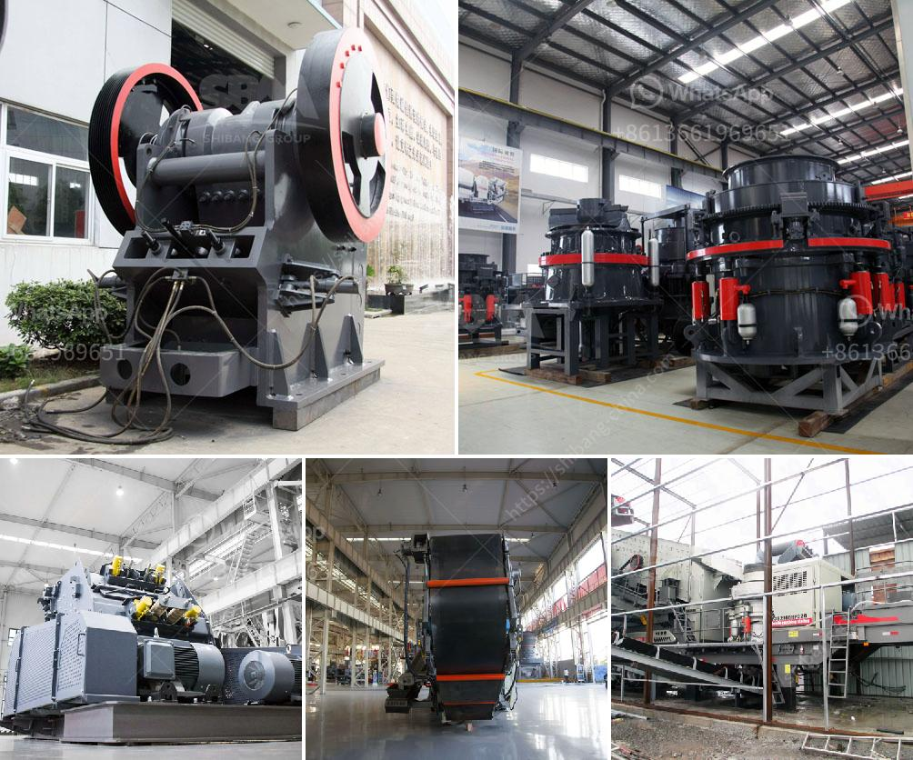

<h3>mobile crushing provider</h3>
In today's fast-paced construction industry, mobile crushing providers play a vital role in improving efficiency and flexibility on job sites. With their ability to move quickly from one location to another, these providers help save time and money while boosting productivity.

Mobile crushing is a process that involves the use of a portable crushing plant to crush and screen debris, concrete, rocks, and other materials at the construction site. This eliminates the need for transportation of materials to a stationary crusher, saving significant costs and reducing environmental impact.

One of the key advantages of mobile crushing providers is their flexibility. Unlike traditional fixed crushers, these machines can be transported to different job sites, enabling construction contractors to easily access their services wherever they are needed. This flexibility allows for rapid response to changing project requirements and timelines, making mobile crushing providers an ideal choice for time-sensitive projects.

Another benefit of mobile crushing is its ability to produce various sizes of aggregate on-site. By eliminating the need to transport materials to a separate location for processing, construction companies can significantly reduce logistical complexities and achieve cost savings. Moreover, the production of on-site aggregate allows for precise customization, meeting specific project requirements and minimizing waste.

In addition to enhancing efficiency, mobile crushing providers also contribute to sustainability in the construction industry. By processing materials on-site, carbon emissions from transportation are greatly reduced, leading to a smaller carbon footprint. Furthermore, the use of recycled materials can be maximized, reducing the demand for new resources and promoting a circular economy.

In conclusion, mobile crushing providers offer a range of benefits to the construction industry. Their ability to move swiftly between job sites, produce customized aggregate, and contribute to sustainability make them an essential resource for construction contractors. As the industry continues to prioritize efficiency and environmental responsibility, the demand for mobile crushing providers is likely to increase.
<h3>Contact us</h3><ul><li><strong>Whatsapp:&nbsp;<a href="https://wa.me/8613661969651">+8613661969651</a></strong></li><li><a href="https://swt.shibang-china.com/?git&amp;zhl&amp;mobile crushing provider"><strong>Online Service(chat now)</strong></a></li></ul><h3>Related</h3><ul><li><a href='crusher stone prices.md'>crusher stone prices</a></li><li><a href='small crusher malaysia.md'>small crusher malaysia</a></li><li><a href='how to pulverized limestone crusher.md'>how to pulverized limestone crusher</a></li><li><a href='powder mill grinding machine in nigeria.md'>powder mill grinding machine in nigeria</a></li><li><a href='raymond mill machine upgrades powder mill machine.md'>raymond mill machine upgrades powder mill machine</a></li></ul>