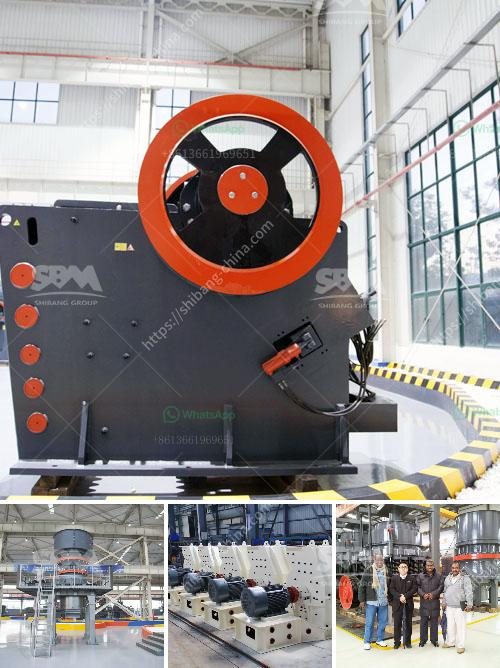

<h3>mobile gold processing plant</h3>
The mining industry is witnessing a significant transformation with the advent of innovative technology solutions. One such game-changing solution is the mobile gold processing plant. As the name suggests, it is a portable processing plant that can be easily moved and operated at the site of gold extraction.

Traditionally, gold mining processes involved the use of heavy machinery and large-scale operations. However, this approach often came with numerous challenges and limitations. The mobile gold processing plant addresses these issues by bringing gold processing to the site of extraction, eliminating the need for costly transportation of ores.

One of the core advantages of a mobile plant is its mobility. Traditional processing plants required miners to transport ores to a central processing facility, leading to significant transportation costs. With a mobile plant, miners can process gold on-site, reducing transportation expenses and making mining operations more efficient.

Moreover, a mobile gold processing plant significantly reduces the time required to start processing operations. Traditional processing plants may take months to set up and start operations. In contrast, a mobile plant can be quickly deployed, enabling miners to begin processing within a short timeframe. This agility is crucial in today's fast-paced mining industry, where time is of the essence.

The mobile gold processing plant also offers flexibility in terms of scalability and adaptability. Miners can easily adjust the processing capacity based on the demand and availability of gold-bearing ores. This allows for optimized resource utilization and greater operational efficiency.

In addition to its mobility and adaptability, a mobile plant offers advanced technological features that enhance gold processing. These features include state-of-the-art equipment and machinery, such as crushers, screens, and concentrators. The plant is equipped with modern control systems that ensure efficient and precise processing, resulting in higher gold recovery rates.

Moreover, a mobile gold processing plant incorporates environmentally friendly practices, reducing the impact on the surrounding ecosystem. The use of advanced filtration systems and efficient water recycling processes minimizes water consumption and helps preserve the natural resources.

The adoption of mobile gold processing plants has the potential to revolutionize the mining industry. It not only improves operational efficiency but also opens up new opportunities for small-scale and artisanal miners. These miners, who often operate in remote and constrained environments, can now access advanced processing technology that was previously only available to larger mining operations.

Furthermore, the mobile gold processing plant presents a sustainable solution to the challenges faced by the mining industry. It allows for responsible mining practices, minimizing the environmental footprint and ensuring the long-term viability of mining operations.

In conclusion, the mobile gold processing plant is a game-changer in the mining industry. Its mobility, scalability, and advanced technological features make it an attractive option for miners looking to optimize their operations. With the ability to process gold on-site, reduce transportation costs, and adopt environmentally friendly practices, the mobile plant offers a promising future for the mining industry.
<h3>Contact us</h3><ul><li><strong>Whatsapp:&nbsp;<a href="https://wa.me/8613661969651">+8613661969651</a></strong></li><li><a href="https://swt.shibang-china.com/?git&amp;zhl&amp;mobile gold processing plant"><strong>Online Service(chat now)</strong></a></li></ul><h3>Related</h3><ul><li><a href='dry iron ore processing methods.md'>dry iron ore processing methods</a></li><li><a href='stone crusher plant kyc.md'>stone crusher plant kyc</a></li><li><a href='quarry crusher equipment for sale brisbane.md'>quarry crusher equipment for sale brisbane</a></li><li><a href='list of all the equipment for gold mining.md'>list of all the equipment for gold mining</a></li><li><a href='top roller mills for sale.md'>top roller mills for sale</a></li></ul>