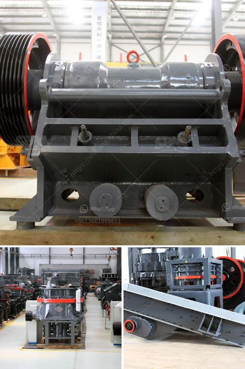

<h3>mobile gypsum crusher</h3>
Gypsum is a versatile, natural mineral that is commonly used in the construction industry. Gypsum stone is first mined, then crushed and ground to a fine powder. Gypsum powder can be used in various industrial applications, such as making plaster, wallboard and cement. Mobile gypsum crusher is not just a mobile crushing and screening plant, but also a unique and efficient production line.

Gypsum is one of the most widely used minerals in construction, known for its fire-resistant properties. The material is crushed and ground into a fine powder, which is then mixed with water to form a paste. This paste is used to create a solid surface when applied to walls and ceilings. Gypsum is also used in the production of cement, as an ingredient to regulate the setting time.

With the increasing demand for gypsum products, the need for efficient crushers has become crucial. Mobile gypsum crushers can be easily transported at any time, reducing transportation costs and allowing for flexibility on job sites. The crushed material can be reused or sold for other purposes, making these crushers a valuable asset in any construction project.

The mobile gypsum crusher can provide a range of grain sizes of the crushed material, which is very important for the following process. Whether the gypsum powder is used for making plaster, wallboard, cement or as a soil improver, it is crucial to process and grind the gypsum into fine particles to promote binding and absorbency.

To achieve this, gypsum mobile crusher includes jaw crusher, cone crusher, impact crusher and sand making machine. The mobile crusher supplier has produced many series and varieties of mobile gypsum crusher with 300-500 tons per hour. The mobile crusher has passed the international certification of ISO9001:2000 and CE certification, which further proves its superior quality.

Mobile gypsum crushers are which can be moved on the railway from the cracked warehouse of the main processing gear to the project internet site, which can be an outdoor building station. The bigger the crusher's allowable feed size, the longer it marches in along the railway. No dismantling is needed when transferring the crushers, and it could be adjusted depending on the actual situation of your work website.

In summary, gypsum mobile crusher is a unique and efficient crushing system that is designed for the needs of recycling, demolition, and quarrying applications. It can be equipped with jaw crusher, impact crusher, cone crusher, and sand making machine, according to the different crushing requirements. Compared with traditional crusher equipment, it has many advantages.

The mobile gypsum crusher with 300-500 tons per hour is available. We can also customize a whole production line for you to get the maximum benefits. Therefore, choose our company and we can definitely give you a satisfied solution.

In conclusion, if you are in the construction industry and require gypsum for various applications, a mobile gypsum crusher is an essential machine to have. With its flexibility and efficiency, it delivers the final pieces needed for a successful project.
<h3>Contact us</h3><ul><li><strong>Whatsapp:&nbsp;<a href="https://wa.me/8613661969651">+8613661969651</a></strong></li><li><a href="https://swt.shibang-china.com/?git&amp;zhl&amp;mobile gypsum crusher"><strong>Online Service(chat now)</strong></a></li></ul><h3>Related</h3><ul><li><a href='types of conveyor belts.md'>types of conveyor belts</a></li><li><a href='dry process of manufacturing calcium phosphate.md'>dry process of manufacturing calcium phosphate</a></li><li><a href='ball mill steel balls suppliers in kerala.md'>ball mill steel balls suppliers in kerala</a></li><li><a href='raymond roller mill drawings.md'>raymond roller mill drawings</a></li><li><a href='ansporting coal conveyor belt.md'>ansporting coal conveyor belt</a></li></ul>