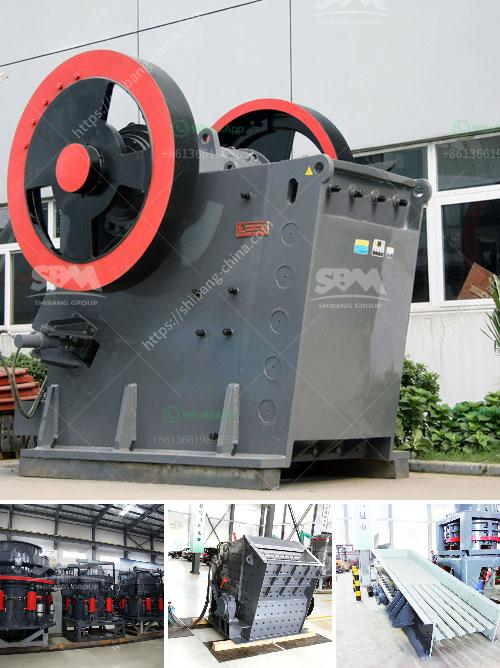

<h3>mobile mineral processing gravity plants</h3>
Mobile mineral processing gravity plants are environmentally friendly because they reduce the need for expensive infrastructure and minimize the use of chemicals. These plants are designed to process raw materials like ores and minerals in remote locations, where traditional mineral processing plants cannot be easily established.

One advantage of mobile gravity plants is their flexibility. They can be easily transported to different sites, enabling mining companies to process materials on-site and save on transportation and logistics costs. This is particularly advantageous for mining operations located in remote areas or countries with limited infrastructure.

Another benefit of mobile gravity plants is their ability to process a wide range of raw materials. These plants use gravity separation techniques, such as jigging or centrifugal separation, to separate minerals based on their specific gravity. This allows for efficient separation of minerals like gold, diamonds, tin, and tungsten, among others. Furthermore, these plants can be easily adapted to process different types of ores or minerals, making them versatile and cost-effective.

In addition to their flexibility and versatility, mobile gravity plants offer an environmentally friendly solution. They rely on gravity separation techniques, which do not require the use of harmful chemicals like cyanide or mercury, commonly used in traditional mineral processing methods. This significantly reduces the environmental impact associated with mineral processing, making it a more sustainable option.

Mobile gravity plants also have a smaller footprint compared to traditional mineral processing plants. They require a minimal amount of land and infrastructure to operate, resulting in a reduced disturbance to the environment and surrounding ecosystems.

Overall, mobile mineral processing gravity plants are a viable solution for mining companies looking for cost-effective, flexible, and environmentally friendly methods of mineral processing. They provide the ability to process raw materials on-site, reduce transportation costs, and minimize the use of harmful chemicals. With these advantages, mobile gravity plants are becoming increasingly popular in the mining industry.
<h3>Contact us</h3><ul><li><strong>Whatsapp:&nbsp;<a href="https://wa.me/8613661969651">+8613661969651</a></strong></li><li><a href="https://swt.shibang-china.com/?git&amp;zhl&amp;mobile mineral processing gravity plants"><strong>Online Service(chat now)</strong></a></li></ul><h3>Related</h3><ul><li><a href='barite ore processing equipment rent and sale.md'>barite ore processing equipment rent and sale</a></li><li><a href='clinker making machine for sell germany.md'>clinker making machine for sell germany</a></li><li><a href='febcoal coal mining plant in ethiopia.md'>febcoal coal mining plant in ethiopia</a></li><li><a href='coal processing plant in australia.md'>coal processing plant in australia</a></li><li><a href='crusher plants for sale in pakistan.md'>crusher plants for sale in pakistan</a></li></ul>