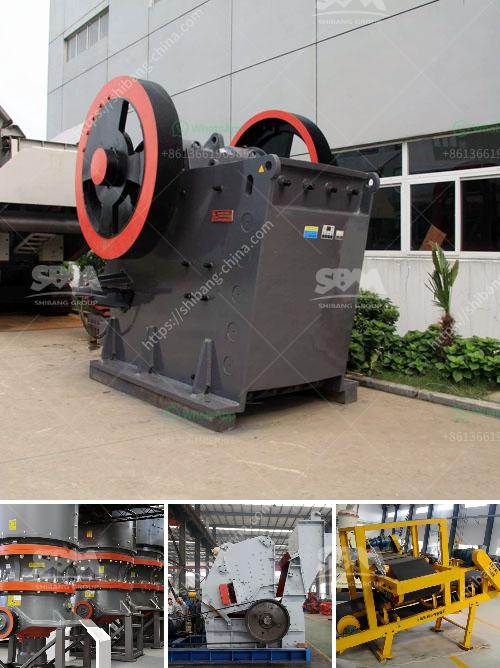

<h3>mobile mini crusher hire</h3>
In today's construction industry, managing construction waste responsibly and efficiently is vital for both environmental and economic reasons. Dumping construction waste in landfills not only harms the environment but also incurs additional costs for businesses. That's where mobile mini crusher hire comes into the picture. This solution offers a convenient and cost-effective way to manage and recycle construction waste on-site.

Simply put, a mobile mini crusher is a compact unit that can be pulled with a truck or trailer. It contains all the necessary equipment for crushing waste materials, such as concrete, bricks, stones, blocks, and even asphalt, making it the ideal choice for efficient recycling on construction sites. With this mobile crusher, contractors can directly reuse the crushed materials on-site for various purposes, saving time and reducing the need for transporting waste to landfills.

One of the main benefits of mobile mini crusher hire is its flexibility. Construction sites often have changing requirements and varying levels of waste generation. With a mobile mini crusher, contractors can easily move the unit to different areas of the site where waste needs to be crushed. This eliminates the need to transport materials to a fixed crusher location, saving businesses time and money.

Additionally, mobile mini crushers are designed to be operated by anyone with basic training, thanks to their user-friendly controls and simple operation. Contractors can quickly learn to operate the unit and start crushing waste materials within minutes. This means that there is no extensive training or specialized personnel required, further reducing the cost of construction waste management.

Furthermore, mobile mini crushers are equipped with advanced features that enhance productivity and efficiency. For instance, some units come with adjustable jaws, allowing contractors to produce different sizes of crushed materials as per their specific requirements. This versatility makes mobile mini crushers suitable for a wide range of construction projects, from small renovations to large-scale developments.

Another advantage of mobile mini crusher hire is its eco-friendliness. By recycling construction waste on-site, businesses can significantly reduce their carbon footprint. Rather than disposing of waste in landfills, which contributes to environmental degradation, construction waste can be crushed and reused, minimizing the need for new raw materials. Recycling waste materials not only saves natural resources but also reduces energy consumption and greenhouse gas emissions.

In conclusion, mobile mini crusher hire offers a convenient and cost-effective solution for construction waste management. Its flexibility, user-friendliness, and productivity make it a practical choice for recycling waste on construction sites. By choosing mobile mini crusher hire, businesses can reduce their environmental impact, save money on waste disposal, and contribute to a sustainable construction industry. So, if you are a contractor looking for an efficient way to manage construction waste, consider the convenience of mobile mini crusher hire.
<h3>Contact us</h3><ul><li><strong>Whatsapp:&nbsp;<a href="https://wa.me/8613661969651">+8613661969651</a></strong></li><li><a href="https://swt.shibang-china.com/?git&amp;zhl&amp;mobile mini crusher hire"><strong>Online Service(chat now)</strong></a></li></ul><h3>Related</h3><ul><li><a href='dolomite crusher manufacturing plant.md'>dolomite crusher manufacturing plant</a></li><li><a href='design calculation in jaw crusher.md'>design calculation in jaw crusher</a></li><li><a href='talc raymond grinding mill.md'>talc raymond grinding mill</a></li><li><a href='limestone crushing processing for the manufacturer.md'>limestone crushing processing for the manufacturer</a></li><li><a href='crusher machine making in pakistan.md'>crusher machine making in pakistan</a></li></ul>