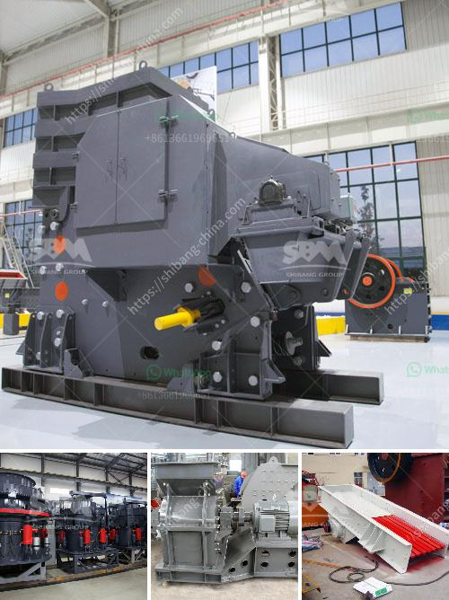

<h3>mobile screening and crushing</h3>
In recent years, the rapid growth of urbanization and infrastructure development has led to a significant increase in construction activities. While these developments bring progress and economic growth, they also generate substantial amounts of construction waste. Disposing of this waste in landfills not only poses environmental concerns but also wastes valuable resources that can be reclaimed and reused. This has given rise to a new industry – mobile screening and crushing – which offers an innovative solution to the challenges posed by construction waste.

Mobile screening and crushing involves the use of track-mounted or wheeled machines, equipped with screens and crushers, to separate and reduce the size of the waste material. This process transforms the waste into valuable resources that can be reused in new construction projects. It not only reduces the environmental impact of waste disposal but also minimizes the need for extracting and processing new raw materials.

One of the key advantages of mobile screening and crushing is its flexibility and efficiency. These machines can be easily transported to the construction site, allowing for on-site processing of waste materials. This eliminates the need for transporting the waste to a separate facility, reducing transportation costs and carbon emissions. Additionally, the mobile nature of these machines enables quick setup and dismantling, allowing for efficient handling of short-term projects or rapidly changing construction sites.

The screening process involves separating the waste material into different sizes using screens with various mesh sizes. This ensures that the final product meets specific requirements and can be used in various applications. The crushed material, on the other hand, is obtained through the use of crushers, which reduce the size of the waste material to a desired level. These machines can process a wide range of materials, including concrete, masonry, asphalt, bricks, and rocks, among others.

The resulting products from mobile screening and crushing offer several benefits. For instance, crushed concrete can be used as a base for new roads or pavements, reducing the need for virgin aggregates. Similarly, crushed asphalt can be recycled and used in new asphalt production, reducing the demand for petroleum-based binders. Additionally, the screening process can separate materials such as wood, metals, and plastics, which can be recycled or repurposed into new products.

The adoption of mobile screening and crushing not only benefits the construction industry but also contributes to sustainable development. It aligns with the principles of the circular economy, by reducing waste generation, lowering environmental impacts, and promoting resource efficiency. Moreover, it helps to meet the increasing demand for sustainable construction practices, which prioritize the reuse and recycling of materials.

As the world continues to urbanize and construction activities continue to grow, the need for effective waste management solutions becomes more pressing. Mobile screening and crushing provides a viable option to tackle the challenges posed by construction waste. By transforming waste into valuable resources, this innovative approach not only contributes to a cleaner environment but also supports the sustainable growth of the construction industry. It is a win-win solution that reduces waste, conserves natural resources, and promotes a more sustainable future.
<h3>Contact us</h3><ul><li><strong>Whatsapp:&nbsp;<a href="https://wa.me/8613661969651">+8613661969651</a></strong></li><li><a href="https://swt.shibang-china.com/?git&amp;zhl&amp;mobile screening and crushing"><strong>Online Service(chat now)</strong></a></li></ul><h3>Related</h3><ul><li><a href='3 tom capecity ball mill.md'>3 tom capecity ball mill</a></li><li><a href='indian river sand grinding machine price.md'>indian river sand grinding machine price</a></li><li><a href='types of ball mills.md'>types of ball mills</a></li><li><a href='quartz beneficiation.md'>quartz beneficiation</a></li><li><a href='feldspar ball mills feldspar ball mills manufacturers.md'>feldspar ball mills feldspar ball mills manufacturers</a></li></ul>