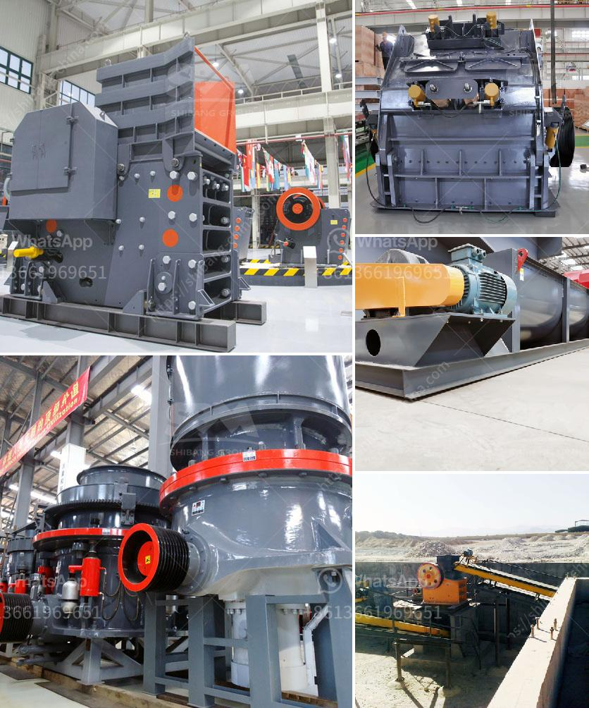

<h3>mobile stone crusher for sale in south africa</h3>
Mobile stone crushers involve mobile jaw crusher ,mobile impact crusher ,mobile cone crusher , and so forth. Shanghai SBM can collocate stone production line using the capacity of 50-70tph, 80-100tph, 100-120tph,120-150tph,and so on. SBM can manufacture various kinds of crushing machines for the South Africa clients and here will introduce two kinds for you all.

Jaw crusher is often a kind of stone crusher with a long history. Using the increase of production, our jaw crusher can tremendously cut down the operating costs. And it is of reliability and flexibility. The following is definitely the detailed informations of your tiny jaw crusher.

The small jaw crusher is a stone crusher manufactured by SBM. According to the actual needs of customers, the device can be equipped with a generator set to facilitate the combination and operation.

This device is mainly used for crushing various types of materials with a compressive strength of not more than 320 MPa. It is mainly used for medium-sized crushing of various ores and bulk materials.

It is widely used in mining, smelting, building materials, highways, railways, water conservancy and chemical industries. The highest compressive strength of materials to be crushed is 320MPa.

The structure of the small jaw crusher mainly includes a frame, an eccentric shaft, a large pulley, a flywheel, a side guard, a toggle plate, a rear bracket of the toggle plate, a gap adjusting screw, a return spring, a fixed jaw plate and a movable jaw plate, etc.

According to the requirements of the feeding size, hardness, and output of the crushed materials, customers can use a variety of configuration forms to customize the production line.

The hollow eccentric shaft is installed in the eccentric sleeve for protection and support of the eccentric shaft, and at the same time, to bear the reaction force of the crushed materials, and to make it withstand the crushing force and make it sturdy.

The flywheel is mainly used to help the crusher run more smoothly throughout its operation. The flywheel also plays a very important role in the operation of the equipment, even if it cannot produce mechanical work. Lower power consumption can reduce energy consumption.

The adjustment device of the crusher is mainly used to adjust the size of the discharge port and the granularity of the crushed materials. There are many types of adjustment devices for cone crushers, so users can choose the most suitable device according to actual production needs.

In South Africa, shanghai SBM has many faithful clients, who do business with shanghai SBM for many years. Equipment installed: Hammer Crusher. Vibrating Screen. If you are interested in crusher for sale in South Africa, please feel free to contact us. We will provide you with top quality products and high quality services.
<h3>Contact us</h3><ul><li><strong>Whatsapp:&nbsp;<a href="https://wa.me/8613661969651">+8613661969651</a></strong></li><li><a href="https://swt.shibang-china.com/?git&amp;zhl&amp;mobile stone crusher for sale in south africa"><strong>Online Service(chat now)</strong></a></li></ul><h3>Related</h3><ul><li><a href='crankshaft of a jaw crusher.md'>crankshaft of a jaw crusher</a></li><li><a href='quarry business cost in india.md'>quarry business cost in india</a></li><li><a href='copper ore conveying system.md'>copper ore conveying system</a></li><li><a href='rock crusher portable.md'>rock crusher portable</a></li><li><a href='vertical roller mill industrial.md'>vertical roller mill industrial</a></li></ul>