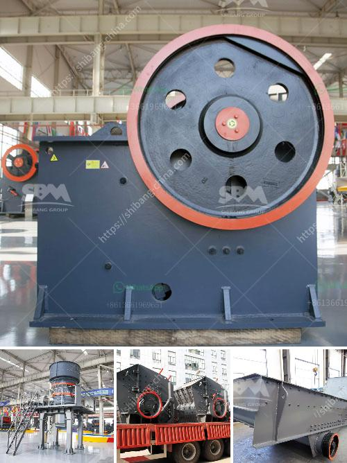

<h3>mobile stone crushing plant</h3>
Mobile stone crushing plant, also known as portable stone crusher plant, has the advantages of easy transportation, low transportation cost, flexible configuration, convenient maintenance, etc. It can be operated as an independent unit or as a two-stage crushing plant with primary and secondary crushing, or as a three-stage crushing plant with primary, secondary, and tertiary crushing according to different clients' requirements.

The mobile stone crushing plant is widely applied in quarry, coal mining, construction waste recycling, earthwork, city infrastructure, road paving, building construction, and so on. It is commonly used in the field of environmental recycling that involves crushing and screening in a compact and mobile way.

Mobile stone crushing plant is suitable for various materials, such as limestone, granite, basalt, river pebble, iron ore, copper ore, etc. It is widely used in mine, smelting, building materials, highway, railway, water conservation project, chemical engineering and other industries.

According to different requirements of the crushing process, mobile stone crushing and screening plant can be divided into the following categories:

1. Mobile jaw crusher plant: This plant is equipped with a jaw crusher and a vibrating screen, making it a versatile primary crushing unit. It is suitable for crushing hard and medium hard materials.

2. Mobile cone crusher plant: This plant uses cone crusher as its secondary crushing unit, greatly reducing the operating cost and improving the working efficiency.

3. Mobile impact crusher plant: This plant can produce high-quality materials with cubic shape and uniform particle size. It is widely used in the field of highway construction, metallurgy, and mining industries.

4. Mobile VSI crusher plant: This plant is equipped with a vertical shaft impact crusher, providing high-quality cubical shaped end products. It is especially suitable for artificial sand making and stone shaping.

The mobile stone crushing plant can be easily transported on highways and moved to crushing sites, reducing material transportation costs. It can also be used as a three-stage crushing operation, with primary, secondary, and tertiary crushing according to different customer requirements. It is flexible in configuration and can be customized to meet different production needs.

In summary, mobile stone crushing plant is a cost-effective and efficient way to process stones and aggregates. With the rapid development of construction industry, more and more construction waste will be generated, which leads to the demand for portable crushers. As experts in the field of crushing and screening equipment, we believe that mobile stone crushing plant will play a key role in the future construction waste recycling market.
<h3>Contact us</h3><ul><li><strong>Whatsapp:&nbsp;<a href="https://wa.me/8613661969651">+8613661969651</a></strong></li><li><a href="https://swt.shibang-china.com/?git&amp;zhl&amp;mobile stone crushing plant"><strong>Online Service(chat now)</strong></a></li></ul><h3>Related</h3><ul><li><a href='limestone crushing processing for the manufacturer.md'>limestone crushing processing for the manufacturer</a></li><li><a href='cement plants capacities of lafarge in nigeria.md'>cement plants capacities of lafarge in nigeria</a></li><li><a href='sand washing plant for sale in uae.md'>sand washing plant for sale in uae</a></li><li><a href='price of medium quarry plant.md'>price of medium quarry plant</a></li><li><a href='chrome ore washing plant.md'>chrome ore washing plant</a></li></ul>