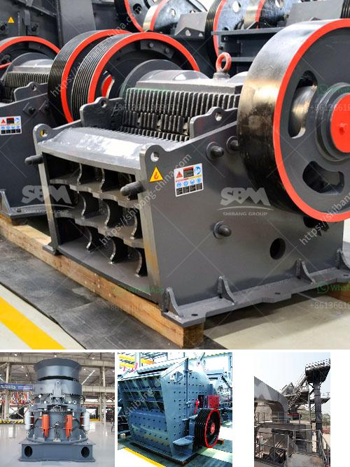

<h3>model of crusher and steps of constructions</h3>
Crushers are an essential piece of machinery used for crushing and reducing large rocks, stones, and minerals into smaller sizes. They are commonly used in quarries, mining, construction, demolition, and recycling operations. With different models available in the market, it is crucial to understand the specific features and construction processes to choose the most suitable crusher for a particular application. In this article, we will discuss the different models of crushers and the steps involved in their construction.

There are several types of crushers available in the market, each designed to meet unique requirements. The most common ones include jaw crushers, cone crushers, impact crushers, and gyratory crushers. Jaw crushers are primarily used for primary crushing and are characterized by a fixed jaw and a moving jaw. Cone crushers, on the other hand, operate by crushing materials between two cone-shaped surfaces. Impact crushers utilize impact forces to crush the material, while gyratory crushers have a rotating movement with a stationary concave surface.

When it comes to constructing a crusher, there are several key steps involved. The first step is to gather the necessary materials and components. These may include steel frames, flywheels, bearings, shafts, crushing plates, and electrical components. The choice of materials depends on factors such as the crusher model, the type of material to be crushed, and the level of durability required.

The second step is the assembly of the crusher. This involves attaching various components together to create a functional unit. The assembly process may require the use of specialized tools and equipment, depending on the complexity of the crusher model. For example, large jaw crushers may require the use of heavy-duty cranes for lifting and positioning heavy components.

Once the crusher is fully assembled, it needs to be tested for proper functioning and safety. This involves conducting performance tests to ensure that the crusher operates smoothly and efficiently. During these tests, various parameters such as crushing capacity, power consumption, and noise levels are evaluated. Necessary adjustments and fine-tuning are made to optimize the crusher's performance.

Finally, the last step is the installation of the crusher at its intended location. This involves careful positioning, alignment, and secure mounting to ensure stability and reliable operation. It is essential to follow the manufacturer's guidelines and recommendations during the installation process to prevent any operational issues or safety hazards.

In conclusion, crushers play a crucial role in various industries where large rocks, stones, and minerals need to be reduced in size. The choice of crusher model depends on the specific requirements of the application. Proper construction and assembly of a crusher involve gathering the necessary materials, component assembly, testing, and finally, installation. By following the correct steps, a well-constructed crusher can provide efficient and reliable performance for years to come.
<h3>Contact us</h3><ul><li><strong>Whatsapp:&nbsp;<a href="https://wa.me/8613661969651">+8613661969651</a></strong></li><li><a href="https://swt.shibang-china.com/?git&amp;zhl&amp;model of crusher and steps of constructions"><strong>Online Service(chat now)</strong></a></li></ul><h3>Related</h3><ul><li><a href='clay kaolin processing equipment.md'>clay kaolin processing equipment</a></li><li><a href='jaw crusher machine for sale.md'>jaw crusher machine for sale</a></li><li><a href='crusher on rent in india.md'>crusher on rent in india</a></li><li><a href='metal conveyor belts in plates.md'>metal conveyor belts in plates</a></li><li><a href='portable limestone jaw crusher for hire in south africa.md'>portable limestone jaw crusher for hire in south africa</a></li></ul>