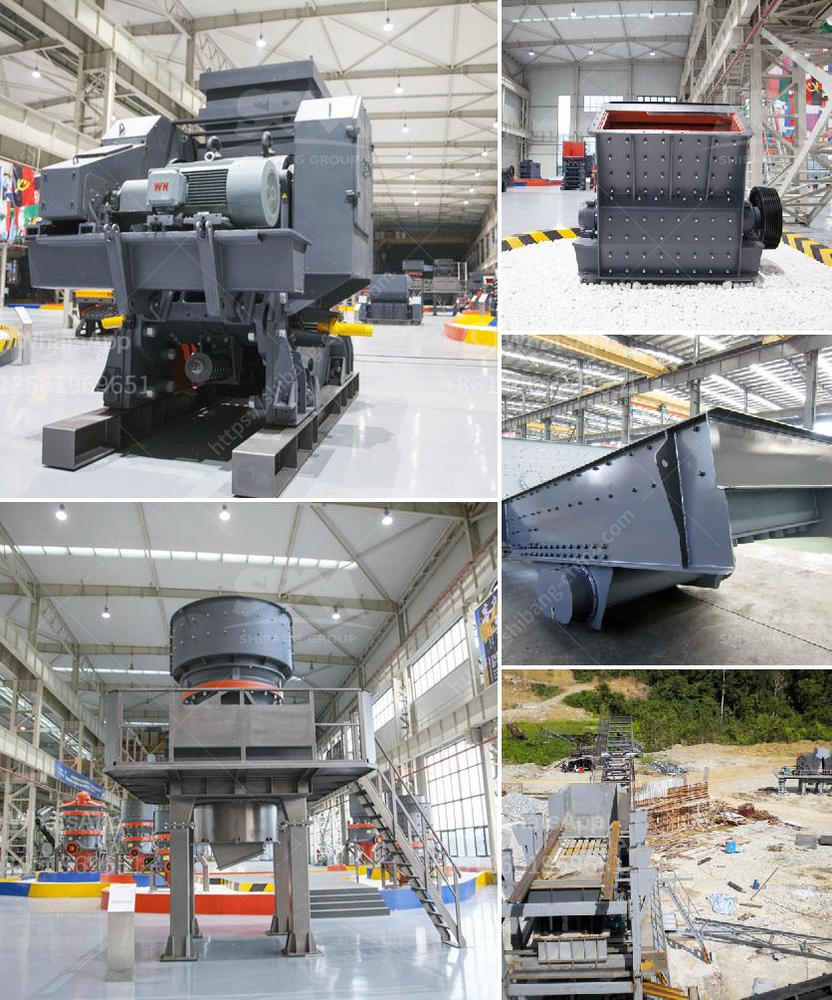

<h3>models of vibrating screens</h3>
Vibrating screens, also known as trommel screens or gyratory screens, are crucial equipment in many industries. They are efficient for sorting, sifting, and separating various materials based on their size or composition. Vibrating screens find applications in mining, construction, aggregate processing, recycling, and other industrial sectors.

There are several models of vibrating screens available, each designed to meet specific requirements. Let's explore some popular models commonly used in the industry:

1. Inclined Screens: This model of vibrating screen has a tilted deck, allowing for better material flow and high screening efficiency. Inclined screens are commonly used in aggregate processing and sand production.

2. Horizontal Screens: These vibrating screens have horizontal decks and are ideal for screening aggregates, sand, and gravel. They are known for their high capacity, efficiency, and longevity.

3. High-Frequency Screens: High-frequency vibrating screens are widely used in mineral processing and fines screening applications. They operate at a high frequency, which helps to separate small particles more efficiently. These screens are ideal for dewatering, desliming, and trash removal.

4. Banana Screens: Banana screens feature multiple deck angles and a linear motion to enhance screening efficiency. They are particularly effective in handling large tonnages of materials and are commonly used in mining and quarrying operations.

5. Trommel Screens: Trommel screens consist of a cylindrical drum with perforated screens. The drum rotates, allowing the smaller materials to fall through the screen while the larger ones move forward. Trommel screens are widely used in the recycling industry, composting, and demolition waste processing.

6. Flip-Flow Screens: Flip-flow screens use elastic mesh screens that vibrate to sort and separate material. This model is effective for screening sticky and wet materials without clogging or blockages.

When choosing a vibrating screen model, factors such as particle size, material characteristics, and desired capacity must be considered. Customization options are also available to meet specific industry needs.

In conclusion, vibrating screens are versatile and essential machines in various industries. Their ability to effectively sort and separate materials based on size or composition makes them indispensable. The choice of vibrating screen model depends on specific requirements and the nature of the material being processed. Consulting with experts and manufacturers can help in selecting the right vibrating screen model for a particular application.
<h3>Contact us</h3><ul><li><strong>Whatsapp:&nbsp;<a href="https://wa.me/8613661969651">+8613661969651</a></strong></li><li><a href="https://swt.shibang-china.com/?git&amp;zhl&amp;models of vibrating screens"><strong>Online Service(chat now)</strong></a></li></ul><h3>Related</h3><ul><li><a href='mobile crusher stone.md'>mobile crusher stone</a></li><li><a href='used rock crusher europe.md'>used rock crusher europe</a></li><li><a href='portable rock crusher machine.md'>portable rock crusher machine</a></li><li><a href='conveyor belts for material.md'>conveyor belts for material</a></li><li><a href='belt conveyor level.md'>belt conveyor level</a></li></ul>