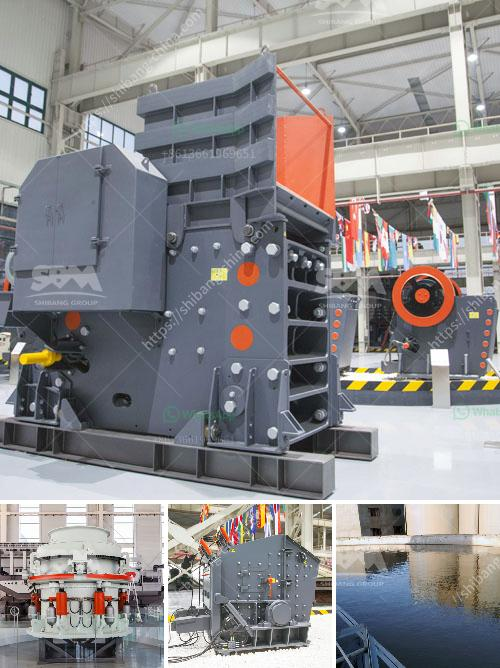

<h3>modular mineral processing plant</h3>
In today's fast-paced world, the demand for minerals and other natural resources is constantly increasing. Mining companies are under pressure to extract these valuable commodities in a sustainable and efficient manner. This is where modular mineral processing plants come into play, revolutionizing the resource extraction industry.

Modular mineral processing plants are portable, self-contained, and scalable systems that can be easily assembled and disassembled to move from one location to another. These plants are designed to process various types of ores, allowing mining companies to extract valuable minerals without the need for extensive infrastructure and costly construction projects.

One of the key advantages of modular mineral processing plants is their adaptability. These plants can be customized to suit specific ore types, ensuring optimal efficiency and maximum recovery rates. Components such as crushing, grinding, screening, and gravity concentration units can be easily interchanged or adjusted to accommodate different ore characteristics, resulting in a more efficient and cost-effective processing solution.

Furthermore, modular mineral processing plants offer significant time and cost savings. Traditional mineral processing plants require substantial lead time and heavy investments in site preparation and construction. In contrast, modular plants can be quickly assembled and put into operation, reducing project timelines by up to 30%. This rapid deployment enables mining companies to start extracting minerals sooner, generating revenue faster.

The scalability of modular mineral processing plants is another noteworthy benefit. These plants can be easily expanded or downsized to match production requirements. As mining operations evolve, the processing plant can be modified accordingly, ensuring optimal resource extraction without overspending. This flexibility allows mining companies to adjust their operations as market demand fluctuates, consequently maximizing their return on investment.

The sustainable nature of modular mineral processing plants is also worth highlighting. These plants can be designed with environmentally friendly technologies, minimizing the impact on nearby ecosystems. Advanced water recycling systems, efficient energy consumption, and reduced emissions are among the ecological features that can be integrated into these plants. By incorporating sustainable practices into their operations, mining companies can align themselves with global environmental goals and regulations.

Lastly, the modular nature of these plants opens up opportunities for remote and challenging mining locations. Whether it is an isolated area or a location with limited infrastructure, modular mineral processing plants can be shipped to almost anywhere in the world. This versatility allows mining companies to access previously untapped resources, expanding the scope of their operations and driving economic growth in remote regions.

In conclusion, modular mineral processing plants have emerged as a revolutionary solution for efficient resource extraction. Their adaptability, time and cost savings, scalability, sustainable design, and remote location capabilities make them a game-changer in the mining industry. As demand for minerals continues to rise, mining companies will increasingly embrace this innovative technology to meet the challenges of the future.
<h3>Contact us</h3><ul><li><strong>Whatsapp:&nbsp;<a href="https://wa.me/8613661969651">+8613661969651</a></strong></li><li><a href="https://swt.shibang-china.com/?git&amp;zhl&amp;modular mineral processing plant"><strong>Online Service(chat now)</strong></a></li></ul><h3>Related</h3><ul><li><a href='rock crusher suppliers in malaysia.md'>rock crusher suppliers in malaysia</a></li><li><a href='construction hammer mill.md'>construction hammer mill</a></li><li><a href='lime stone crusher machine manufacturing company china.md'>lime stone crusher machine manufacturing company china</a></li><li><a href='stone crusher machine for sale kenya.md'>stone crusher machine for sale kenya</a></li><li><a href='ball mill zenit crusher china.md'>ball mill zenit crusher china</a></li></ul>