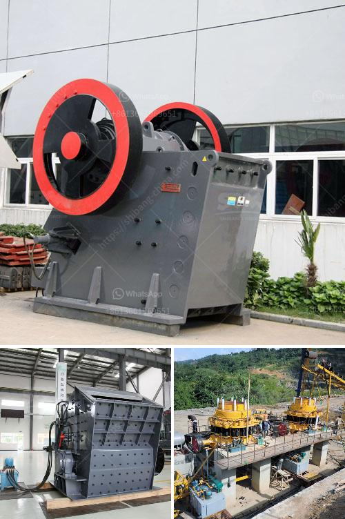

<h3>mtm 70 ball mill how much capacity</h3>
The MTM series trapezium mill is a popular grinding machine used for grinding non-flammable and non-explosive materials. In recent years, the MTM 70 ball mill has gained wide recognition as one of the best grinding machines on the market due to its excellent performance and capacity.

The MTM 70 ball mill is a medium-speed trapezium mill, which is primarily used for grinding raw materials in the cement industry and also suitable for grinding various ores and other materials. This machine has a capacity of 3 tons per hour, which is perfect for small-scale production.

One of the key features of the MTM 70 ball mill is its advanced motor system. This mill is equipped with a high-power motor, providing enough energy to grind materials efficiently and effectively. The motor's power ensures that the mill operates smoothly, without any hiccups or interruptions during the grinding process. Additionally, the motor's power also contributes to the mill's impressive capacity, allowing it to process large quantities of materials in a short span of time.

Another notable feature of the MTM 70 ball mill is its sturdy construction. The mill is built using high-quality materials, which guarantee its durability and long lifespan. Its strong structure ensures that it can withstand heavy usage and continues to deliver consistent performance over an extended period. This feature is especially important in industrial settings where the mill is subjected to intense grinding operations.

Furthermore, the MTM 70 ball mill is designed with a user-friendly interface, allowing operators to easily control and monitor the grinding process. The machine's controls are intuitive and straightforward, enabling operators to adjust various parameters such as speed, feed rate, and grinding time effortlessly. Moreover, the mill's clear display provides real-time information, enabling operators to track the progress of the grinding process and make necessary adjustments for optimal results.

The MTM 70 ball mill's capacity makes it an ideal choice for small and medium-scale production environments. Its ability to process up to 3 tons of materials per hour ensures that manufacturers can meet their production targets efficiently. Whether it is grinding cement clinker or processing ores, this mill is capable of delivering consistent, high-quality results.

In conclusion, the MTM 70 ball mill is a versatile and reliable grinding machine suitable for various applications in the cement industry and other industries. Its excellent capacity of 3 tons per hour, coupled with its advanced motor system and sturdy construction, makes it a top choice for manufacturers seeking efficient and productive grinding solutions. With its user-friendly interface, operators can easily control and monitor the grinding process, ensuring optimal results every time.
<h3>Contact us</h3><ul><li><strong>Whatsapp:&nbsp;<a href="https://wa.me/8613661969651">+8613661969651</a></strong></li><li><a href="https://swt.shibang-china.com/?git&amp;zhl&amp;mtm 70 ball mill how much capacity"><strong>Online Service(chat now)</strong></a></li></ul><h3>Related</h3><ul><li><a href='laporan praktikum jaw crusher dan analisis ayakan.md'>laporan praktikum jaw crusher dan analisis ayakan</a></li><li><a href='stone crusher supplier company.md'>stone crusher supplier company</a></li><li><a href='schredder and grinding mille for sale.md'>schredder and grinding mille for sale</a></li><li><a href='nigeria raymond mill.md'>nigeria raymond mill</a></li><li><a href='basin a grinding roller mill.md'>basin a grinding roller mill</a></li></ul>