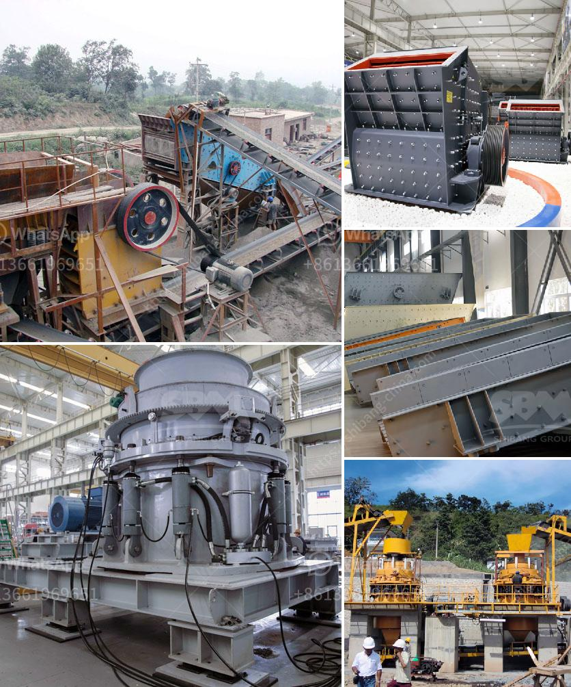

<h3>much does it cost to set up a cement factory</h3>
Setting up a cement factory is no easy task, as it requires extensive planning, expertise, and finances. The cement industry continues to grow worldwide, driven by increasing demands in both developing and developed countries for various infrastructure projects, such as roads, highways, buildings, and bridges. If you are considering setting up a cement factory, understanding the cost involved is crucial. In this article, we will explore the factors that contribute to the overall cost of establishing a cement factory.

The location of a cement factory plays a vital role in determining its cost. A favorable location would be close to limestone mines, as limestone is the primary raw material used in cement production. Proximity to transportation infrastructure, such as roads, rail networks, and ports, is also crucial for the efficient movement of raw materials and finished products. While an ideal location might drive up the initial land acquisition cost, it would reduce transportation expenses in the long run.

Setting up a cement factory requires significant investments in machinery and equipment. The comprehensive range of machinery includes crushers, mixers, conveyors, kilns, and storage facilities, among other specialized equipment. The cost of procuring these machines depends on their quality, capacity, and level of automation. Newer technological advancements designed for efficiency and sustainability may lead to higher initial costs but could result in long-term cost savings.

Employing skilled labor and experienced professionals in the field is essential for a successful cement factory. From engineers and technicians to production line workers, a well-trained workforce is crucial for efficient operations. The cost of labor will depend on the wage rates prevailing in the region, and it is necessary to include training costs to ensure the workforce is well-equipped to handle the production process effectively.

Compliance with environmental regulations and obtaining the necessary permits and certifications can significantly impact the cost of setting up a cement factory. Environmental assessments and mitigations, waste management systems, and pollution control technologies are crucial factors to consider. Costs associated with these aspects may include environmental impact studies, pollution control equipment, and ongoing compliance monitoring.

The availability and cost of raw materials and energy are substantial exponents in estimating the overall cost of a cement factory. Procuring limestone, clay, iron ore, and other supplementary materials for cement production could require establishing long-term contracts with mines. Additionally, energy resources, such as coal, natural gas, or alternative fuels, are vital for running the kilns. Analyzing local availability, transportation costs, and long-term supply contracts are essential considerations in this regard.

Beyond the aforementioned core aspects, other miscellaneous expenses contribute to the overall setup cost. These include administrative and legal costs, insurance, taxation, and contingency budgets for unforeseen circumstances. Additionally, developing an effective marketing and distribution strategy to reach customers and establish market presence should be factored into the cost estimation.

In conclusion, setting up a cement factory requires significant capital investment. The total cost involved varies depending on various factors, such as location, machinery, labor, permits, raw materials, energy, and miscellaneous expenses. It is essential to conduct a meticulous feasibility study and engage experts to ensure accurate cost estimation. By carefully evaluating these aspects, potential cement factory investors can make informed decisions to embark on a successful venture in the dynamic cement industry.
<h3>Contact us</h3><ul><li><strong>Whatsapp:&nbsp;<a href="https://wa.me/8613661969651">+8613661969651</a></strong></li><li><a href="https://swt.shibang-china.com/?git&amp;zhl&amp;much does it cost to set up a cement factory"><strong>Online Service(chat now)</strong></a></li></ul><h3>Related</h3><ul><li><a href='hammer mills for limestone.md'>hammer mills for limestone</a></li><li><a href='mining equipment for hire zimbabwe.md'>mining equipment for hire zimbabwe</a></li><li><a href='ball mill for grinding metal.md'>ball mill for grinding metal</a></li><li><a href='cone crusher supplier.md'>cone crusher supplier</a></li><li><a href='mining equipment for sale.md'>mining equipment for sale</a></li></ul>