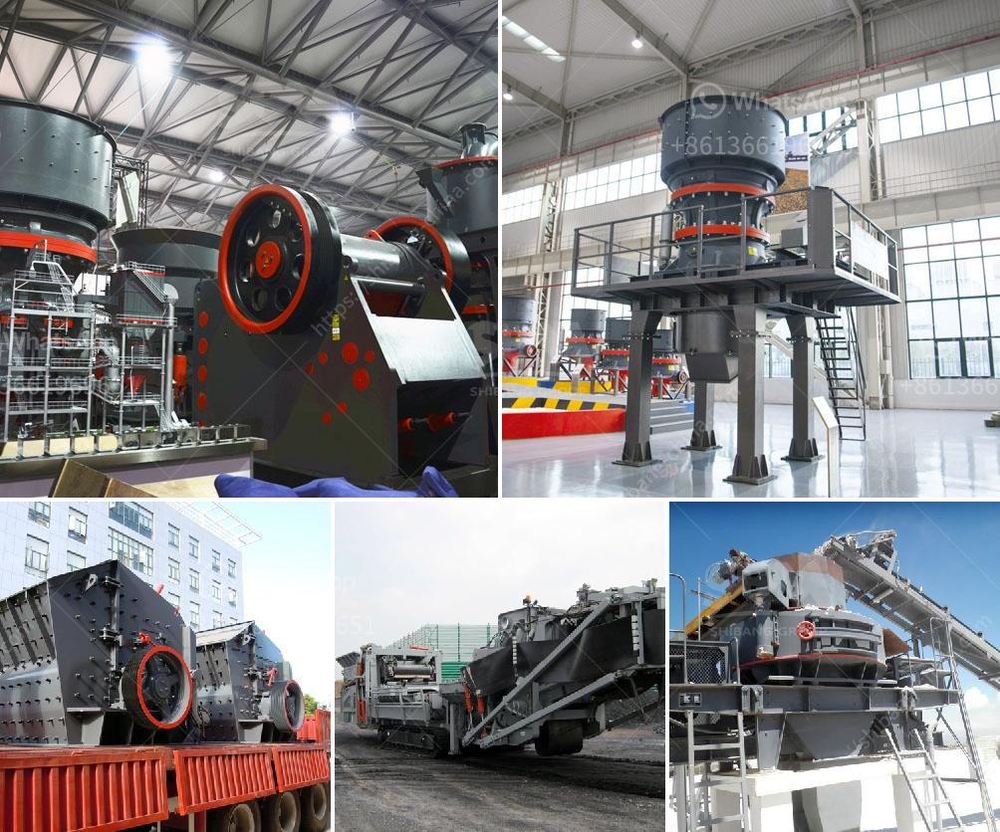

<h3>new mobile and fixed rock crushing plant</h3>
There is no denying the fact that the world has a growing infrastructure that requires high-quality materials and minerals. The availability of natural resources is decreasing day by day, and the demand is skyrocketing. To meet this ever-increasing demand for aggregates, sand, and minerals, the construction industry is constantly evolving and adopting new technologies. One such innovative solution is the new mobile and fixed rock crushing plant.

This crushing plant is specifically designed for the efficient processing of rocks, such as granite, basalt, and iron ore. It is equipped with advanced technology and has excellent crushing capacity. The plant has a combination of a jaw crusher along with an impact crusher, making it the best choice for a wide range of applications.

The new mobile and fixed rock crushing plant are equipped with innovative features that can go a long way in saving time, money, and effort. The plant is also able to process hard-rock materials, making it highly versatile in terms of potential applications. This flexibility is particularly important in the construction industry, where each project has its unique requirements.

One of the key advantages of the new mobile and fixed rock crushing plant is its quick setup time. This reduces the downtime, allowing operators to quickly move from one site to another. This means that contractors can complete more projects in less time, resulting in increased productivity and profitability.

The plant also comes with remote control functionality, which enables operators to monitor and control the machine from a distance. This feature not only ensures operator safety but also enhances productivity. The ability to control the crushing plant remotely allows operators to optimize the performance and efficiency of the machine, resulting in better-quality materials and higher output.

Another unique feature of the new mobile and fixed rock crushing plant is its high fuel efficiency. The plant is designed to operate with minimal fuel consumption without compromising on performance. This translates into significant cost savings in terms of fuel expenses, making the plant an economical choice for businesses of all sizes.

The crushing plant also incorporates integrated dust suppression and noise reduction systems. This is particularly important in urban areas where noise and dust pollution are major concerns. The plant's environmental-friendly design ensures compliance with strict regulations while minimizing the impact on the surrounding environment.

In conclusion, the new mobile and fixed rock crushing plant is a powerful machine that offers superior performance and efficiency. Its innovative features make it a versatile solution for a wide range of applications in the construction industry. With quick setup time, remote control functionality, high fuel efficiency, and environmental-friendly design, this crushing plant is a game-changer in the industry. It enables contractors to complete projects faster, reduce operating costs, and deliver high-quality materials. The mobile and fixed rock crushing plant is undoubtedly a valuable asset for any construction company looking to boost their productivity and profitability.
<h3>Contact us</h3><ul><li><strong>Whatsapp:&nbsp;<a href="https://wa.me/8613661969651">+8613661969651</a></strong></li><li><a href="https://swt.shibang-china.com/?git&amp;zhl&amp;new mobile and fixed rock crushing plant"><strong>Online Service(chat now)</strong></a></li></ul><h3>Related</h3><ul><li><a href='mtm 70 ball mill how much capacity.md'>mtm 70 ball mill how much capacity</a></li><li><a href='used concrete crushers for sale in ontario.md'>used concrete crushers for sale in ontario</a></li><li><a href='project feasibility report on stone crusher.md'>project feasibility report on stone crusher</a></li><li><a href='hammer mill for ldpe grinding.md'>hammer mill for ldpe grinding</a></li><li><a href='stone crusher sale lease.md'>stone crusher sale lease</a></li></ul>