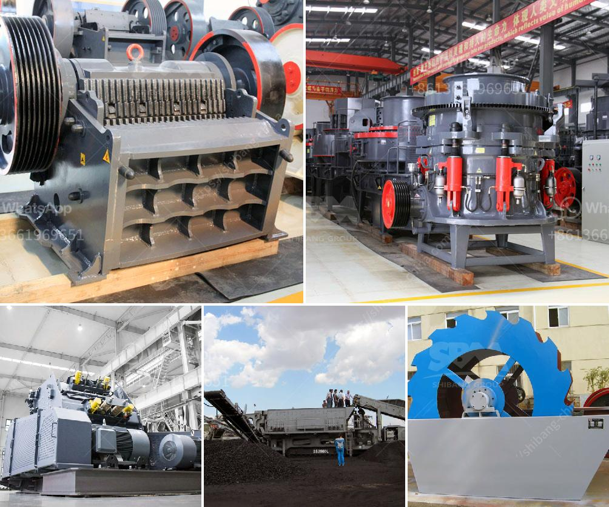

<h3>new stamp mill for sale in zimbabwe</h3>
Title: Introducing the New Stamp Mill for Sale in Zimbabwe: An Essential Equipment for Gold Processing

With the ability to process materials at an impressive rate of five tons per hour, the stamp mill remains a crucial tool in the world of gold mining. The emergence of the new stamp mill for sale in Zimbabwe, on the other hand, may prove to be a boon to the small-scale and artisanal miners who rely on mercury to extract gold.

Indeed, stamp mills offer a practical processing solution for gold mining operators and investors alike. Compared to traditional mercury-based methods, this innovative technology offers both environmental and health benefits. By eliminating the need for mercury, miners can now process gold ore safely and sustainably, curbing the damaging effects of this toxic substance on both nature and human health.

The new stamp mill, currently being developed by Premier Adverts, aims to address the needs of small-scale miners in Zimbabwe. Its design and construction mark a step forward in milling technology that can meet the demanding accessibility and practicality requirements of every miner in the region.

1. Enhanced Gold Recovery: The state-of-the-art stamp mill is equipped with a gravity recovery system that can quickly and effectively capture and retain gold particles. This ensures maximum gold extraction, allowing miners to yield higher profits with less effort and expense.

2. Low Costs and High Durability: The new stamp mill is designed to be robust, reliable, and affordable. With high-quality materials and exceptional engineering, it can withstand the harsh conditions and heavy usage that miners often face. Moreover, its operational costs are significantly lower compared to traditional mercury-based methods.

3. Minimal Environmental Impact: Unlike mercury-based gold processing, the new stamp mill technology is eco-friendly. It avoids the pollution caused by mercury and reduces the depletion of natural resources. This makes it a sustainable choice for small-scale and artisanal miners, who are increasingly prioritizing environmentally responsible practices.

4. User-Friendly Design: The new stamp mill is designed with ease of use in mind. Its simple and efficient design allows for easy installation and operation. Miners can quickly integrate the stamp mill into their existing processing systems or set up new, stand-alone plants with minimal hassle.

5. Government Support: The Zimbabwean government, recognizing the importance of promoting responsible and sustainable mining practices, has initiated various policies and programs to support small-scale mining. The availability of the new stamp mill for sale in Zimbabwe will unlock new opportunities for gold mining investors and allow them to achieve their goals effectively.

In conclusion, while the traditional mercury-based method remains widely used, the new stamp mill technology is quickly gaining popularity among small-scale and artisanal miners in Zimbabwe. With enhanced gold recovery, lower costs, and minimal environmental impact, this advanced milling solution offers a promising future for gold mining operations across the country. As the industry continues to evolve towards more sustainable practices, the new stamp mill becomes an indispensable tool that maximizes gold output while minimizing harm to the environment and human health.
<h3>Contact us</h3><ul><li><strong>Whatsapp:&nbsp;<a href="https://wa.me/8613661969651">+8613661969651</a></strong></li><li><a href="https://swt.shibang-china.com/?git&amp;zhl&amp;new stamp mill for sale in zimbabwe"><strong>Online Service(chat now)</strong></a></li></ul><h3>Related</h3><ul><li><a href='project feasibility report on stone crusher.md'>project feasibility report on stone crusher</a></li><li><a href='coal crusher manufacturer.md'>coal crusher manufacturer</a></li><li><a href='mobile mini crusher hire.md'>mobile mini crusher hire</a></li><li><a href='difference between pebble and rock.md'>difference between pebble and rock</a></li><li><a href='zambia mobile crusher.md'>zambia mobile crusher</a></li></ul>