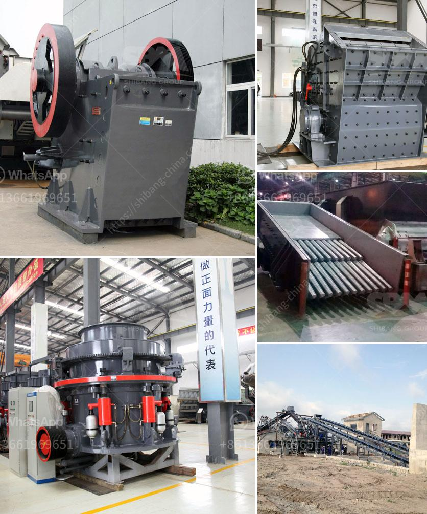

<h3>nigeria c125 jaw crusher</h3>
The Nigeria C125 jaw crusher is a high-quality and efficient machine that is widely used in construction and mining industries. In recent years, the Nigerian infrastructure construction has been growing rapidly, and the demand for sand, gravel and other construction materials has increased significantly. As a result, the market for crushers in Nigeria has become more and more prosperous.

The C125 jaw crusher is a sturdy, powerful machine that is designed to provide high quality and reliability even in the toughest operating conditions. Its crushing capacity is ideal for reducing large rocks or ore into smaller, more manageable sizes. With a maximum feed size of 950mm and a maximum closed side setting of 125mm, this jaw crusher can efficiently process materials and deliver excellent product shape.

The C125 jaw crusher features a unique design that allows the crusher to be easily disassembled and transported in a standard shipping container. This makes it convenient for relocation and reduces transportation costs. Additionally, the machine is equipped with a hydraulic setting adjustment system, which allows the operator to easily adjust the crusher settings to meet the desired product size requirements.

One of the key advantages of the C125 jaw crusher is its high productivity. The machine is capable of processing up to 600 tons per hour, making it suitable for large-scale production operations. It also features a long jaw plate life and a low operating cost, which further enhances its efficiency and economic benefits.

In terms of safety and maintenance, the C125 jaw crusher is equipped with advanced safety features and easy maintenance access. It has a safety pin that prevents accidental starting of the crusher during maintenance or repairs. The machine also has a replaceable jaw die system that minimizes downtime and increases productivity.

Furthermore, the C125 jaw crusher is highly adaptable to various crushing applications. It can efficiently crush a wide range of materials, including limestone, granite, basalt, and even hard rocks. Whether it is used for primary crushing or secondary crushing, this machine delivers superior performance.

In conclusion, the Nigeria C125 jaw crusher is a powerful and efficient machine that is ideal for construction and mining industries in Nigeria. Its compact size, high productivity, and low operating costs make it a highly sought-after crushing solution. With its advanced features and reliable performance, this jaw crusher has become the preferred choice for many Nigerian companies.
<h3>Contact us</h3><ul><li><strong>Whatsapp:&nbsp;<a href="https://wa.me/8613661969651">+8613661969651</a></strong></li><li><a href="https://swt.shibang-china.com/?git&amp;zhl&amp;nigeria c125 jaw crusher"><strong>Online Service(chat now)</strong></a></li></ul><h3>Related</h3><ul><li><a href='ball mills antapaccay.md'>ball mills antapaccay</a></li><li><a href='manufacturers peru hammer mill.md'>manufacturers peru hammer mill</a></li><li><a href='used mobile crusher in nigeria.md'>used mobile crusher in nigeria</a></li><li><a href='philippines kenya stone crusher.md'>philippines kenya stone crusher</a></li><li><a href='raymond mills usa.md'>raymond mills usa</a></li></ul>