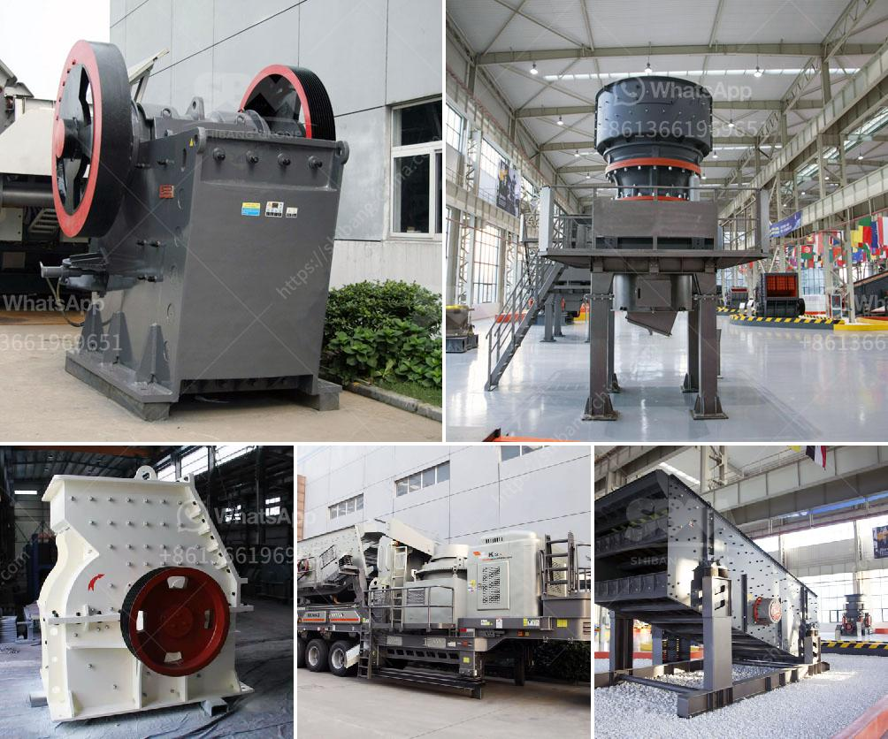

<h3>nigeria crusher industries</h3>
Nigeria, the most populous country in Africa, has a vibrant and dynamic economy with diverse sectors contributing to its growth and development. One of the sectors that has played a significant role in Nigeria's industrialization is the crusher industries.

Crusher industries in Nigeria are primarily involved in the production of various minerals used as raw materials in construction, manufacturing, and other industries. These industries are responsible for crushing large rocks and stones into smaller sizes, which are often used as aggregates in concrete production, road construction, and building materials manufacturing.

The crusher industries in Nigeria have experienced significant growth over the years, thanks to the country's increasing demand for infrastructure development and rapid urbanization. Nigeria's expanding population has led to a surge in the construction of residential and commercial buildings, roads, bridges, and other infrastructure projects, thereby driving the need for crushed stones and aggregates.

These industries have not only contributed to Nigeria's economic growth but have also created employment opportunities for thousands of individuals. The crusher industries employ a significant number of workers, including engineers, operators, technicians, and laborers, thus reducing the country's unemployment rate and improving the livelihoods of many Nigerians.

Moreover, the crusher industries have played a vital role in the local manufacturing sector by providing essential raw materials. By producing crushed stones and aggregates, these industries have supported the growth of other sectors such as concrete production, asphalt manufacturing, and building materials production. This has led to a decrease in Nigeria's reliance on imported construction materials and promoted self-sufficiency in the local manufacturing sector.

Despite the significant contribution of the crusher industries to Nigeria's growth and development, they still face challenges. Some of these challenges include inadequate infrastructure, limited access to capital, and the need for advanced technologies to improve efficiency and productivity. However, with the government's continued support and investment in infrastructure development and modernization, the crusher industries in Nigeria are poised to thrive and further contribute to the country's progress.

In conclusion, the crusher industries in Nigeria have played a crucial role in the country's economic growth and development. These industries have provided essential raw materials for construction and manufacturing, generated employment opportunities, and supported the growth of other sectors. With proper infrastructure and technological advancements, Nigeria's crusher industries are well-positioned to continue driving the country's industrialization and contribute to its overall prosperity.
<h3>Contact us</h3><ul><li><strong>Whatsapp:&nbsp;<a href="https://wa.me/8613661969651">+8613661969651</a></strong></li><li><a href="https://swt.shibang-china.com/?git&amp;zhl&amp;nigeria crusher industries"><strong>Online Service(chat now)</strong></a></li></ul><h3>Related</h3><ul><li><a href='quarry crusher for sale.md'>quarry crusher for sale</a></li><li><a href='limestone processing plant in benin.md'>limestone processing plant in benin</a></li><li><a href='iron crushing plant.md'>iron crushing plant</a></li><li><a href='granite mining business plan.md'>granite mining business plan</a></li><li><a href='aggregate for cement block making.md'>aggregate for cement block making</a></li></ul>