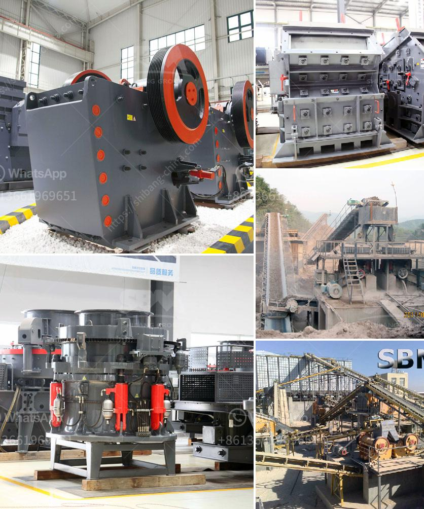

<h3>nigeria grinding mill</h3>
Nigeria, known as the "Giant of Africa," holds a significant position in the agricultural sector, contributing to the country's economic and social development. However, the absence of modern machinery and equipment has limited the efficiency and productivity of the industry. In recent years, the introduction of the Nigeria grinding mill has offered a sustainable solution, revolutionizing the agricultural landscape.

The grinding mill, a powerful piece of machinery, has replaced the traditional mortar and pestle, offering faster and more efficient grinding for agricultural products. This technology is particularly vital for small-scale farmers and agro-processing industries, as it allows them to process large quantities of produce within a shorter span of time.

One of the key advantages of the Nigeria grinding mill is its versatility. It can be powered by electricity, diesel, or even solar energy, making it suitable for various locations and farming setups. This has been a game-changer for off-grid areas, where access to a stable power supply is limited.

Furthermore, the grinding mill caters to different types of agricultural produce, ranging from maize, millet, and sorghum to beans and cereals. By ensuring that farmers can process their crops themselves, the grinding mill promotes self-sufficiency and reduces reliance on imported processed goods.

Increased productivity is another benefit of the grinding mill. With this machinery, small-scale farmers and agro-processing industries can now process higher volumes of produce, leading to greater market availability and more economical pricing for consumers. Farmers no longer have to rely solely on selling raw produce but can also add value to their crops by grinding them into flour and other finished products.

Additionally, the grinding mill has significantly reduced post-harvest losses. In the past, farmers were unable to process their crops in a timely manner, leading to spoilage and wastage. Now, with the ability to grind their produce, farmers can preserve the quality and freshness of their crops, extending their shelf life and minimizing losses.

Moreover, the grinding mill has opened up new opportunities for the creation of small-scale agro-processing industries. With the increased efficiency and productivity offered by this machinery, entrepreneurs can set up grinding mills to provide grinding services to farmers in the surrounding areas, generating employment and stimulating local economies.

In conclusion, the Nigeria grinding mill has emerged as a sustainable, technology-driven solution for farmers and agro-processing industries. Its versatility, powered by various energy sources, makes it accessible to all, regardless of location or power supply availability. By increasing productivity and reducing post-harvest losses, this machinery plays a pivotal role in transforming the agricultural sector and fostering economic growth. With the continued adoption of grinding mills, Nigeria is well on its way to becoming a leading force in both local and global agricultural markets.
<h3>Contact us</h3><ul><li><strong>Whatsapp:&nbsp;<a href="https://wa.me/8613661969651">+8613661969651</a></strong></li><li><a href="https://swt.shibang-china.com/?git&amp;zhl&amp;nigeria grinding mill"><strong>Online Service(chat now)</strong></a></li></ul><h3>Related</h3><ul><li><a href='barmac crushers for sale.md'>barmac crushers for sale</a></li><li><a href='lime grinder unit lime size.md'>lime grinder unit lime size</a></li><li><a href='price of conveyor belts for mining.md'>price of conveyor belts for mining</a></li><li><a href='dry process of manufacturing calcium phosphate.md'>dry process of manufacturing calcium phosphate</a></li><li><a href='crushing plants for sale.md'>crushing plants for sale</a></li></ul>