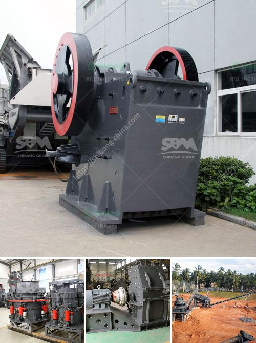

<h3>nigeria mobile vsi crusher</h3>
In recent years, Nigeria has made tremendous strides in the aggregate and asphalt sectors. With the introduction of mobile vertical shaft impact (VSI) crushers to the market, the possibilities for applications in limestone, dolomite, and demolitions are endless. This is because mobile VSI crushers are designed to adapt to different requirements, eliminating obstacles in the crushing environment while providing customers with efficient and low-cost operation.

The growth of Nigeria's economy has led to an increase in road construction and improvements in infrastructure. As a result, construction companies and contractors are in constant need of high-quality materials for project execution. Mobile VSI crushers are ideal for tertiary crushing and screening applications in quarrying, mining, concrete recycling, infrastructure, and construction industries. It is especially used to process raw materials for concrete, asphalt, and surfacing aggregates.

The mobile VSI crusher's benefit from flexibility as they can easily be moved from one site to another, as well as be configured to suit different crushing applications. With this versatility, operators can count on the equipment to handle a wide range of materials, including hard and abrasive rocks, gravel, sand, and limestone. This makes it an ideal choice for producing products such as concrete aggregates, road-base materials, and manufactured sand.

The main advantage of using a mobile VSI crusher is the ability to maximize productivity and reduce operating costs. By utilizing advanced crushing technology, the crusher produces a consistent and high-quality final product with excellent shape and size distribution. This leads to improved efficiency in downstream processes such as screening and concrete production.

Another important feature of mobile VSI crushers is their superior safety standards. Equipped with safety guards and emergency stops, operators can work with peace of mind, knowing that their safety is prioritized. Additionally, the crushers are designed with a user-friendly control panel that allows operators to adjust and monitor the settings easily. This ensures optimized performance and maximum productivity at all times.

Furthermore, investing in a mobile VSI crusher can contribute to environmental sustainability. By reusing materials, such as crushed concrete, construction waste, or mining waste, the crushers play a significant role in reducing waste and conserving natural resources. This not only benefits the environment but also saves costs associated with purchasing and transporting virgin materials.

In conclusion, the introduction of mobile VSI crushers in Nigeria has revolutionized the crushing industry as they offer numerous benefits over traditional crushers. In addition to maximizing productivity and reducing operating costs, mobile VSI crushers provide a safe and environmentally friendly solution for crushing and recycling needs. With Nigeria's growing construction and infrastructure development, the demand for high-quality materials will only increase. Therefore, investing in a mobile VSI crusher is a wise choice for any company or contractor looking to boost efficiency and profitability in the crushing industry.
<h3>Contact us</h3><ul><li><strong>Whatsapp:&nbsp;<a href="https://wa.me/8613661969651">+8613661969651</a></strong></li><li><a href="https://swt.shibang-china.com/?git&amp;zhl&amp;nigeria mobile vsi crusher"><strong>Online Service(chat now)</strong></a></li></ul><h3>Related</h3><ul><li><a href='mining jaw crusher pe.md'>mining jaw crusher pe</a></li><li><a href='price list coal crushing plant.md'>price list coal crushing plant</a></li><li><a href='mobile stone crusher for sale in south africa.md'>mobile stone crusher for sale in south africa</a></li><li><a href='clinker grinding unit for cement clinker in india.md'>clinker grinding unit for cement clinker in india</a></li><li><a href='stone crushing machines south africa.md'>stone crushing machines south africa</a></li></ul>