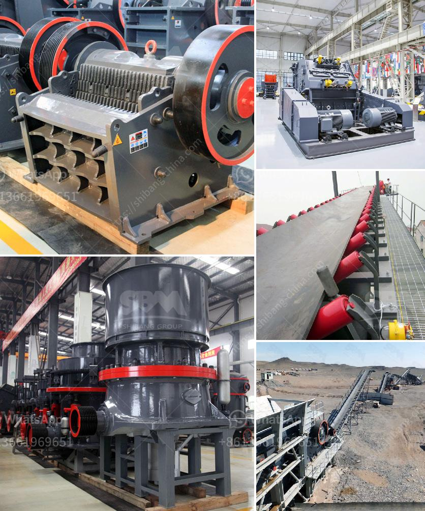

<h3>nigeria raymond mill</h3>
Nigeria is one of the largest countries in Africa and has a vast amount of natural resources, including oil, gas, and minerals. As the economy continues to grow rapidly, there is an increasing need for industrial development, particularly in the manufacturing and mining sectors. One key aspect of this development is the availability of efficient machinery and equipment. In this regard, Raymond Mills have proven to be crucial.

Raymond Mills are commonly used in the grinding of minerals and non-metallic materials, such as limestone, gypsum, marble, calcite, barite, dolomite, talc, petroleum coke, bentonite, kaolin, and other ores. This grinding method has been extensively utilized in many industries such as mining, construction, metallurgy, chemicals, and ceramics. The Raymond mill is an energy-efficient alternative to traditional coal mills and offers a wide range of fineness levels for various materials.

The Raymond mill has a reputation for being highly reliable and consistently performs well even in the most demanding conditions. It has been widely used in Nigeria's manufacturing and mining industries. It is critical to note that Raymond Mills are equipped with advanced technologies, which significantly enhance their performance. For instance, the high-pressure suspension roller mill adopts a high-density blade, which increases its grinding efficiency by 10-30% and reduces the energy consumption by 15-30%. This allows manufacturers to achieve the desired powder fineness quickly while minimizing production costs.

Another advantage of the Raymond Mill is its low maintenance requirement. It is built to withstand harsh working conditions and requires minimal repairs or servicing. This feature is particularly important in Nigeria, where regular maintenance can be challenging due to limited technical expertise and resources.

Furthermore, the Raymond Mill's capacity to produce a wide range of particle sizes makes it highly versatile. Manufacturers can easily adjust the fineness of the final product, making it suitable for various applications. For instance, in the cement industry, Raymond Mills are used to grind clinker into powder to produce cement. In the paint and coating industry, Raymond Mills are used to grind pigments and fillers for paint production. The possibilities are endless.

The use of Raymond Mills in Nigeria has contributed significantly to the country's economic growth. It has enabled local industries to produce high-quality products that meet international standards. Additionally, the use of Raymond Mills has created employment opportunities, as manufacturers need skilled workers to operate and maintain these machines. As a result, it has helped reduce unemployment rates and improve living standards.

In conclusion, Raymond Mills have revolutionized the manufacturing and mining industries in Nigeria. They provide an efficient and reliable grinding solution, ensuring the production of high-quality products while minimizing energy consumption and maintenance requirements. Nigeria's industrial development is set to thrive with the continued usage of Raymond Mills, making it a vital asset for the country's economic growth.
<h3>Contact us</h3><ul><li><strong>Whatsapp:&nbsp;<a href="https://wa.me/8613661969651">+8613661969651</a></strong></li><li><a href="https://swt.shibang-china.com/?git&amp;zhl&amp;nigeria raymond mill"><strong>Online Service(chat now)</strong></a></li></ul><h3>Related</h3><ul><li><a href='talc grinding machine manufacturer from uzbekistan.md'>talc grinding machine manufacturer from uzbekistan</a></li><li><a href='small scale stone crusher price list.md'>small scale stone crusher price list</a></li><li><a href='250tph complete crushing plant.md'>250tph complete crushing plant</a></li><li><a href='jaw crusher 600x900 indonesia.md'>jaw crusher 600x900 indonesia</a></li><li><a href='price of stone crusher.md'>price of stone crusher</a></li></ul>