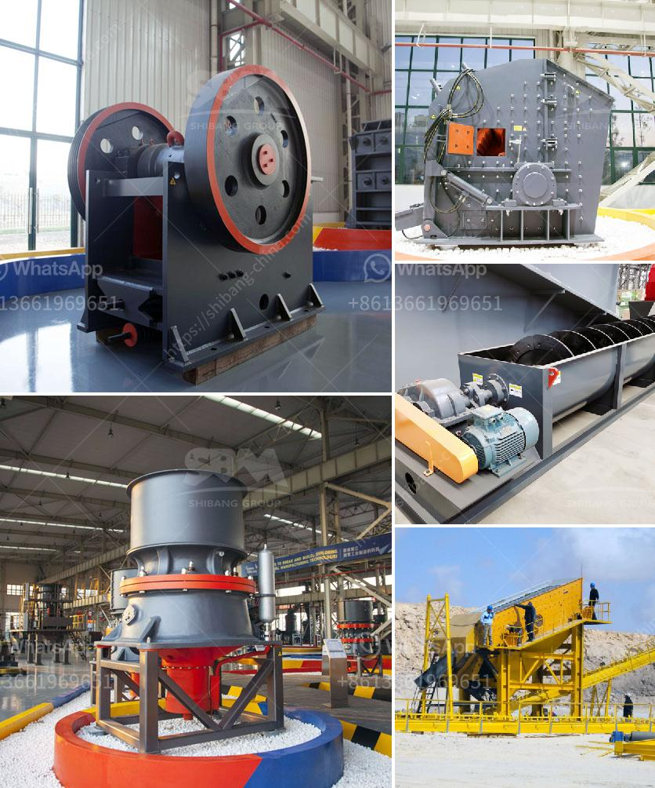

<h3>objective of ball mill machine</h3>
The ball mill machine is a type of grinding equipment used to grind materials into extremely fine powder. This machine is widely used in various industrial sectors, such as building materials, chemical industry, cement, mineral processing, and metallurgy.

The ball mill machine has multiple functions, including material grinding, blending, and mixing. The objective of this machine is to grind and blend various materials into fine powder, which can be used in manufacturing several products, such as paint, pyrotechnics, ceramics, etc. It is also used in the mining industry to grind ores and other materials for flotation or leaching purposes.

The primary objective of ball mill machine is to turn materials into fine powder. For this purpose, several variables can be adjusted, such as the speed of rotation, the size of the balls, the material feed rate, and the size of the grinding media. By adjusting these variables, the final product can be fine-tuned to meet the specific requirements of the application.

One of the main advantages of using a ball mill machine is its ability to produce a fine particle size distribution, which is beneficial for downstream processes. Fine particles have larger surface areas, which enhance the reactivity and solubility of the material. This is especially important in industries such as cement, where finely ground materials are used to create high-strength concrete.

The ball mill machine also provides a specific size range, which allows for efficient separation and classification of particles. This is particularly important in mineral processing applications, where different size fractions are needed to separate valuable minerals from gangue materials. By controlling the size of the grinding media and adjusting the material feed rate, the desired particle size can be achieved.

Another objective of the ball mill machine is to achieve uniform mixing and blending of materials. This is particularly important in industries such as ceramics, where different raw materials need to be thoroughly mixed to ensure consistent product quality. By rotating the mill and using the grinding media, materials can be mixed homogeneously, resulting in a uniform composition.

In addition to grinding, blending, and mixing, the ball mill machine can also be used for mechanical alloying. This process involves the synthesis of new materials through mechanical deformation and mixing of different elements. Mechanical alloying is commonly used to produce powders with improved properties, such as increased hardness, wear resistance, and corrosion resistance.

In conclusion, the ball mill machine is a versatile grinding equipment that achieves fine particle size distribution, uniform mixing and blending, and mechanical alloying. This machine has many applications in various industries, including chemical, cement, mineral processing, and metallurgy. By adjusting the variables and controlling the grinding process, the ball mill machine can produce desired final products with specific properties.
<h3>Contact us</h3><ul><li><strong>Whatsapp:&nbsp;<a href="https://wa.me/8613661969651">+8613661969651</a></strong></li><li><a href="https://swt.shibang-china.com/?git&amp;zhl&amp;objective of ball mill machine"><strong>Online Service(chat now)</strong></a></li></ul><h3>Related</h3><ul><li><a href='kenya electrical jaw crusher 32 x 58.md'>kenya electrical jaw crusher 32 x 58</a></li><li><a href='steed conveyor belting.md'>steed conveyor belting</a></li><li><a href='super fine grinding mills.md'>super fine grinding mills</a></li><li><a href='used rotary kiln equipment for sale.md'>used rotary kiln equipment for sale</a></li><li><a href='gold mining equipment pdf.md'>gold mining equipment pdf</a></li></ul>