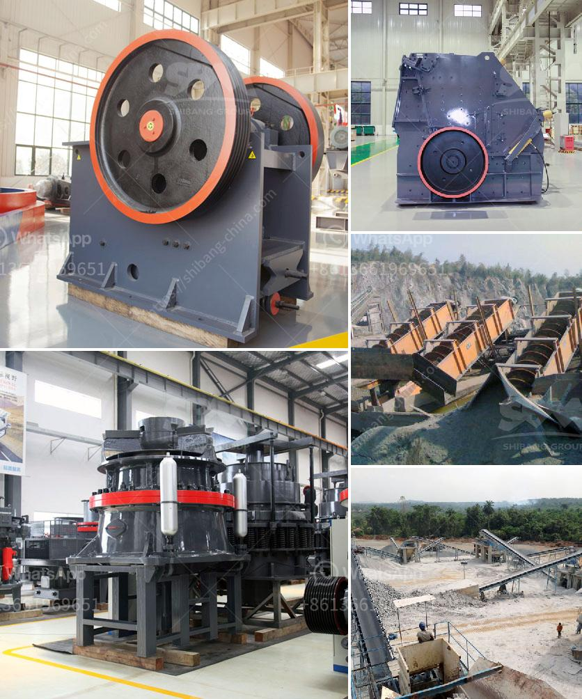

<h3>pakistan chromite crusher equipment</h3>
Pakistan is a developing country that is blessed with rich natural resources. One of the resources that Pakistan is well-renowned for is its chromite deposits. The country is home to some of the largest chromite ore deposits in the world. With proper mining techniques, these deposits can be utilized to benefit the country's economy and provide much-needed employment opportunities.

To extract chromite from the ore, various equipment is required. The primary equipment for this purpose is crusher equipment. Crushers are used to break down the raw materials into smaller pieces so that they can be further processed. In the case of chromite, crushers are usually used to extract the largest chunks of ore.

There are several types of crushers that are commonly used in the chromite mining process. Jaw crushers, impact crushers, cone crushers, and VSI (vertical shaft impact) crushers are the most commonly utilized crushers in this process. Each of these crushers has different capabilities and functions, making them suitable for different stages of the mining process.

Jaw crushers are primarily used for initial crushing of chromite ore. They are commonly utilized in the first stage of processing, where the ore is broken down into smaller pieces. Impact crushers are often used in the second stage of processing, where further reduction of the ore is required. Cone crushers and VSI crushers are used in the final stage of processing, where the crushed ore is refined into finer particles.

The use of crusher equipment in chromite mining not only improves the efficiency of ore processing but also minimizes the environmental impacts associated with the extraction. By breaking down the ore into smaller pieces, crushers reduce the amount of waste material that needs to be processed, thus reducing the overall environmental footprint.

In conclusion, Pakistan's chromite deposits have the potential to contribute significantly to the country's economy. Utilizing crusher equipment is crucial for efficient extraction of chromite ore. Proper mining techniques, combined with the use of appropriate equipment, can help maximize the benefits of chromite mining while minimizing its environmental impact.
<h3>Contact us</h3><ul><li><strong>Whatsapp:&nbsp;<a href="https://wa.me/8613661969651">+8613661969651</a></strong></li><li><a href="https://swt.shibang-china.com/?git&amp;zhl&amp;pakistan chromite crusher equipment"><strong>Online Service(chat now)</strong></a></li></ul><h3>Related</h3><ul><li><a href='gyratory crusher prices.md'>gyratory crusher prices</a></li><li><a href='dolomite to gypsum plants in south africa.md'>dolomite to gypsum plants in south africa</a></li><li><a href='industerial ball mill for sale.md'>industerial ball mill for sale</a></li><li><a href='prices crusher prices gypsum crusher prices.md'>prices crusher prices gypsum crusher prices</a></li><li><a href='crusher machine south africa.md'>crusher machine south africa</a></li></ul>