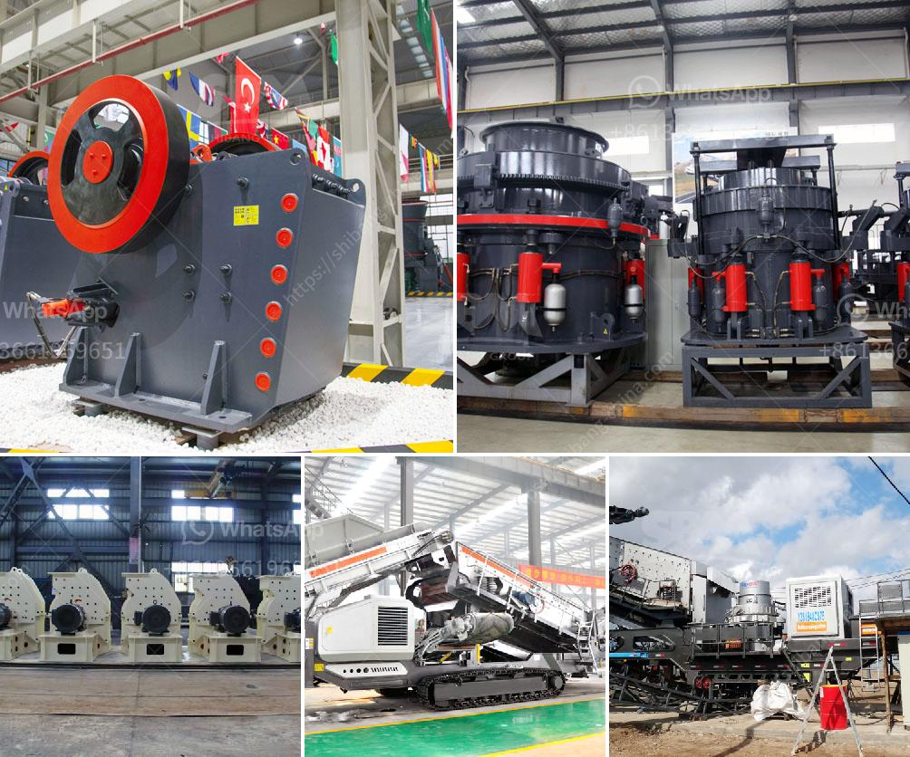

<h3>pakistan coal crushing plant in peshawar</h3>
Pakistan has rich coal resource. With the emphasis of it, efficient coal crushing machine is greatly needed in Pakistan. Our coal crusher equipment can be a form of machine that is utilized in coal processing industry. We also supplies all sorts processing machines, coal screening plant and design beneficiation plant in line with the requirements of customers, for example coal crushing process plant, iron ore crushing plant, coal crushing and grinding plant provided with best price. In the coal crushing plant, the coal must be processed and crushed into different sizes, 0 ~ 25 mm particle size for coal gas stove, 25 ~ 8 mm for steam locomotive, 25 ~ 6 mm for the industrial furnace, and coal power plant requires grain coal of 0 ~ 25mm.

In the coal crushing plant, coal crushing can resize the coal stone so that it can be easily handled and processed. For the Mosh hardness of coal is usually under 5, the miners can use jaw crusher, impact crusher, hammer crusher, etc. to handle it. After the coal has been crushed, we need vibrating screen to grade the coal by size and then transport the coal via belt conveyor. In this process, dewatering screen is optional to remove water from the product.

SBM is a global supplier and manufacturer of crushing, grinding, sand making and beneficiation plant. We provide complete sets coal crusher plant for sale in Pakistan. SBM coal crushing plant has been exported to many countries around the world, such as India, South Africa, Canada, Australia, Russia, Indonesia, Zambia, Zimbabwe, Pakistan, Kenya, Guinea, Omen, etc.

In order to help customers to learn more about the operation status of the production line quickly and directly, we equipped an intelligent control system for the production line, which can monitor the start and stop status and operation data of the equipment, and make users master the project progress. More importantly, the intelligent control system significantly improves the production efficiency and reduces labor costs.

The coal crushing plant in Peshawar is the key crushing plant in this process. Primary coal crusher works in the first stage of coal crushing process. Coal raw materials are firstly poured into vibrating feeder, which they will be fed into primary coal crusher continuously and evenly. Primary crusher is usually jaw crusher or impact crusher, producing lump coal cinder. Secondary coal crusher crushes the lump coal cinder transported by coal conveyor. Secondary coal crusher usually includes hydraulic impact crusher, cone crusher and JC jaw crusher. It produces sand size coal particlc which can be used in pretreatment of coal directly.

Tertiary coal crusher resizes coal particlc into coal powder. Tertiary crusher is used in special occasions like the coal grinding mill has special requirements on the feeding size. Cone crusher can act as the tertiary coal crusher because of its fine final outlets. coal plant 250 tph - 300 tph

coal crusher. coal mill. coal crushing plant. coal grinding equipment. coal processing plant. coal powder plant. coal preparation plant.

In terms of production capacity, the coal crushing plant in Peshawar is able to exceed 2000 tonnes per hour and the coal crusher plant is able to process up to 500 tons of coal per hour. It consists of different types of crushers, a screening plant, and the necessary conveying and feeding equipment in its working process. Regardless of which type of machine you choose, it should be based on your needs. So, it is recommended to consult with specialists and obtain detailed information.
<h3>Contact us</h3><ul><li><strong>Whatsapp:&nbsp;<a href="https://wa.me/8613661969651">+8613661969651</a></strong></li><li><a href="https://swt.shibang-china.com/?git&amp;zhl&amp;pakistan coal crushing plant in peshawar"><strong>Online Service(chat now)</strong></a></li></ul><h3>Related</h3><ul><li><a href='clay ball mill machine browns.md'>clay ball mill machine browns</a></li><li><a href='calcium roller mill.md'>calcium roller mill</a></li><li><a href='standard operating procedures for cone crusher.md'>standard operating procedures for cone crusher</a></li><li><a href='grinding garnet machine.md'>grinding garnet machine</a></li><li><a href='steel hammer mill.md'>steel hammer mill</a></li></ul>