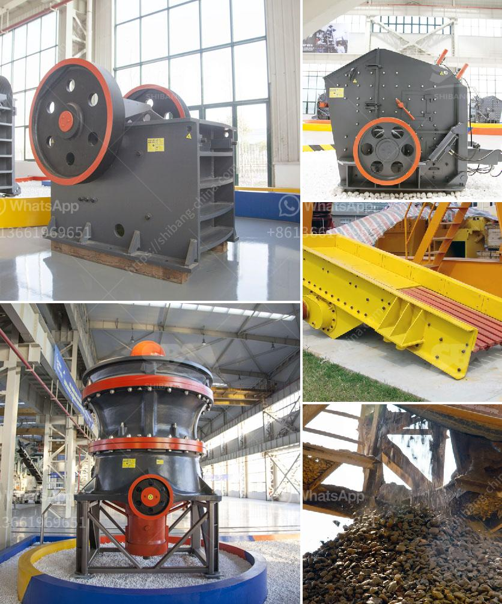

<h3>pakistan directory of cement plants list pdf</h3>
Pakistan is a developing nation that is experiencing a rapid growth in its infrastructure sector. The cement industry in Pakistan plays a vital role in the country's economic development. The directory of cement plants in Pakistan provides a comprehensive list of facilities that are engaged in the production of cement and are registered with the All Pakistan Cement Manufacturers Association (APCMA).

The directory is available in a PDF format, which allows easy access to the information by individuals and organizations involved in the construction industry. The list includes both integrated cement plants, which produce clinker from raw materials, and grinding plants, which produce cement through the grinding of clinker and other additives.

The directory provides a detailed profile of each cement plant, including information such as the plant's location, contact details, production capacity, and ownership structure. This information is crucial for investors, contractors, and other stakeholders who are interested in partnering with or sourcing from these cement plants.

Moreover, the directory also highlights the sustainability initiatives undertaken by each cement plant, emphasizing their commitment to environmental protection and resource conservation. These initiatives include the use of alternative fuels, waste heat recovery systems, and the adoption of efficient technologies for reducing energy consumption and carbon emissions.

The availability of the Pakistan directory of cement plants list PDF promotes transparency and facilitates informed decision-making in the construction industry. It allows potential buyers of cement to compare the offerings of different plants based on their location, production capacity, and environmental performance. Furthermore, it enables contractors to identify cement suppliers near their project sites, ensuring timely and cost-effective delivery.

In conclusion, the Pakistan directory of cement plants list PDF serves as a valuable resource for stakeholders in the construction industry. It provides essential information about cement plants in Pakistan, enabling informed decision-making and fostering collaboration between different players in the industry. With its emphasis on sustainability, the directory also promotes the adoption of eco-friendly practices in cement production to contribute to Pakistan's sustainable development.
<h3>Contact us</h3><ul><li><strong>Whatsapp:&nbsp;<a href="https://wa.me/8613661969651">+8613661969651</a></strong></li><li><a href="https://swt.shibang-china.com/?git&amp;zhl&amp;pakistan directory of cement plants list pdf"><strong>Online Service(chat now)</strong></a></li></ul><h3>Related</h3><ul><li><a href='how to wash sand for construction.md'>how to wash sand for construction</a></li><li><a href='dolomite to gypsum plants in south africa.md'>dolomite to gypsum plants in south africa</a></li><li><a href='barite mining crusher process.md'>barite mining crusher process</a></li><li><a href='size of balls in ball mill.md'>size of balls in ball mill</a></li><li><a href='sand washing plant for sale in uae.md'>sand washing plant for sale in uae</a></li></ul>