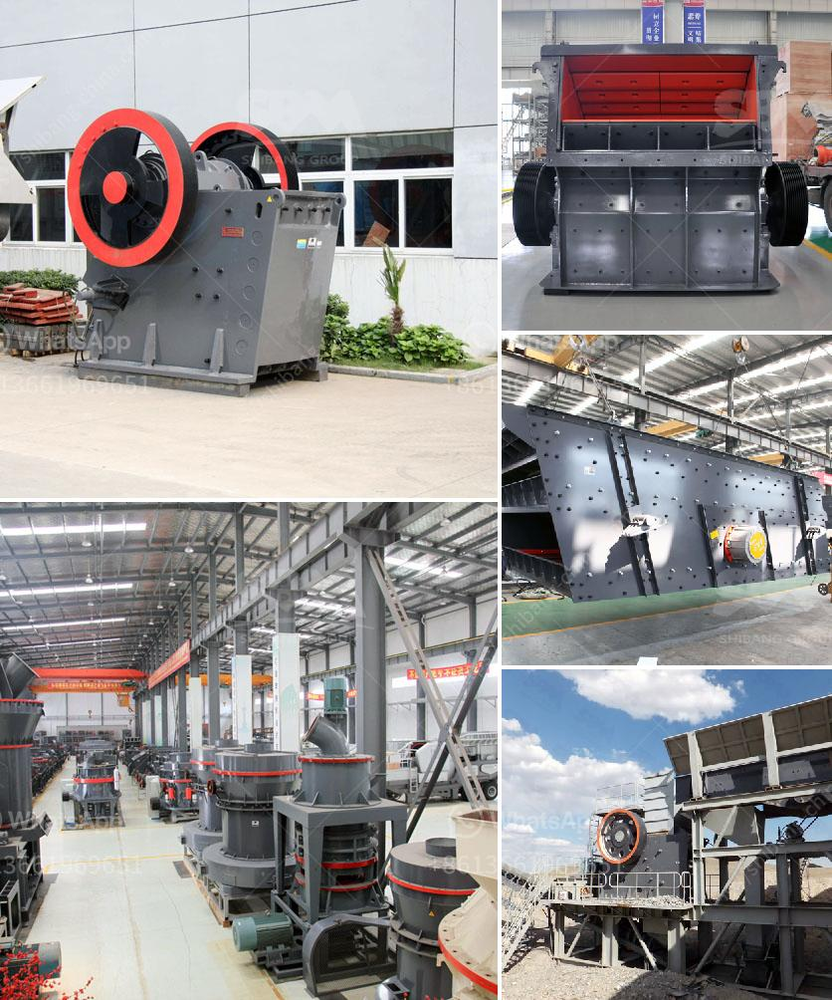

<h3>part of ball mills</h3>
Ball mills are a crucial equipment used for grinding materials after crushing. They are widely used in cement, silicate products, refractory materials, fertilizers, black and non-ferrous metal beneficiation, and glass ceramics industries. It is crucial to design and engineer these mills carefully to ensure optimal performance and efficiency.

One crucial part of a ball mill is the liner, which protects the mill shell and enhances its lifetime. Over time, liners may become worn and can impact the efficiency of the mill. Liners are usually made of manganese steel, rubber, or ceramic materials. The choice of liner material depends on various factors such as the type of ore being ground, the size distribution of the grinding media, and the expected operating conditions.

Another essential part of a ball mill is the grinding media, which may be made of steel balls, ceramic balls, or natural pebbles. It is responsible for reducing the size of the material being processed and ensuring the desired particle size distribution. The choice of grinding media depends on factors such as the hardness of the material being ground and the required final product size.

The motor is another essential part of a ball mill, as it provides the necessary power to rotate the mill. The motor can be a synchronous or asynchronous one, and its power output depends on the size and capacity of the mill.

Additionally, a ball mill consists of a drive system, which ensures that the machine operates smoothly and efficiently. This drive system can be either open or closed. In open circuit systems, the material passes through the mill once and is discharged while the mill is still in operation. In closed circuit systems, the material passes through the mill multiple times, and the desired product is obtained after being screened through a separator and classified according to size.

In conclusion, ball mills play a crucial role in the mining and processing industries by reducing the size of materials and ensuring optimal grinding efficiency. The design and engineering of ball mills, including the liners, grinding media, motor, and drive system, are all critical in achieving the desired results. By understanding the different parts of a ball mill, operators can optimize their usage and ensure maximum productivity and longevity of the mill.
<h3>Contact us</h3><ul><li><strong>Whatsapp:&nbsp;<a href="https://wa.me/8613661969651">+8613661969651</a></strong></li><li><a href="https://swt.shibang-china.com/?git&amp;zhl&amp;part of ball mills"><strong>Online Service(chat now)</strong></a></li></ul><h3>Related</h3><ul><li><a href='supplier of crusher equipment in ghana.md'>supplier of crusher equipment in ghana</a></li><li><a href='how much is a gold crusher in kenya.md'>how much is a gold crusher in kenya</a></li><li><a href='cost of cassava milling machine in ghana.md'>cost of cassava milling machine in ghana</a></li><li><a href='jaw crushers sale.md'>jaw crushers sale</a></li><li><a href='crushing and screening distributing in philippines.md'>crushing and screening distributing in philippines</a></li></ul>