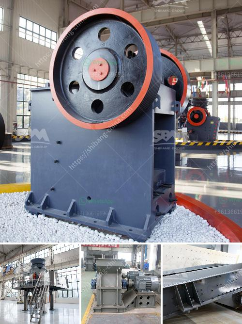

<h3>pe crusher machine in pakistan</h3>
PE crusher machine is a plastic recycling machine used to shred and crush plastic materials. The machine is commonly used in Pakistan in the plastic recycling industry to reduce the size or form of plastic waste materials so they can be easily disposed or reused.

Plastic waste is a growing environmental concern in Pakistan, as the country produces a large amount of plastic waste each year. According to a report by the United Nations Environment Programme, Pakistan generates approximately 20 million tons of solid waste annually, out of which 5-7% is plastic waste. The improper disposal of plastic waste leads to pollution of water bodies, soil, and air, and poses a threat to human and animal health.

To address the issue of plastic waste and promote a circular economy, the recycling of plastic waste has become essential. The PE crusher machine plays a crucial role in the plastic recycling process as it helps in reducing the size of plastic waste materials. The machine shreds and crushes plastic waste into smaller pieces, making it easier to handle, transport, and recycle.

The PE crusher machine is equipped with sharp blades or hammers that rotate at high speeds to break down the plastic waste materials. The machine can handle various types of plastic materials, including bottles, containers, packaging materials, and more. It can also process different forms of plastic waste such as solid pieces, films, and fibers.

One of the key advantages of the PE crusher machine is its ability to reduce the volume of plastic waste materials. By shredding and crushing the plastic waste, the machine significantly reduces the bulk of the materials, allowing for more efficient storage and transportation. This is particularly beneficial for the plastic recycling industry in Pakistan, where limited space and infrastructure make it essential to compress the waste materials.

In addition to reducing the size of plastic waste, the PE crusher machine also helps in improving the quality of the recycled plastic. When the plastic waste is crushed into smaller pieces, it becomes easier to sort and separate different types of plastics. This makes it possible to produce high-quality recycled plastic that can be used in various industries, including packaging, construction, and manufacturing.

Furthermore, the PE crusher machine is designed to be energy-efficient and environmentally friendly. It is equipped with advanced technologies that minimize noise and dust emissions during the crushing process. This ensures a safer and cleaner working environment for operators and reduces the impact on the surrounding environment.

In conclusion, the PE crusher machine plays a vital role in the plastic recycling industry in Pakistan. It helps in reducing the size and form of plastic waste materials, making them easier to handle and recycle. With the increasing focus on environmental sustainability, the use of PE crusher machines is expected to grow, as they contribute to the circular economy by promoting plastic waste recycling and reducing pollution.
<h3>Contact us</h3><ul><li><strong>Whatsapp:&nbsp;<a href="https://wa.me/8613661969651">+8613661969651</a></strong></li><li><a href="https://swt.shibang-china.com/?git&amp;zhl&amp;pe crusher machine in pakistan"><strong>Online Service(chat now)</strong></a></li></ul><h3>Related</h3><ul><li><a href='jaw crusher diagram.md'>jaw crusher diagram</a></li><li><a href='rotary breaker for coal 200tph.md'>rotary breaker for coal 200tph</a></li><li><a href='china talc processing factory rental ghana.md'>china talc processing factory rental ghana</a></li><li><a href='200 ton mini cement plant project cost in india.md'>200 ton mini cement plant project cost in india</a></li><li><a href='gold ore rock processing equipment price.md'>gold ore rock processing equipment price</a></li></ul>