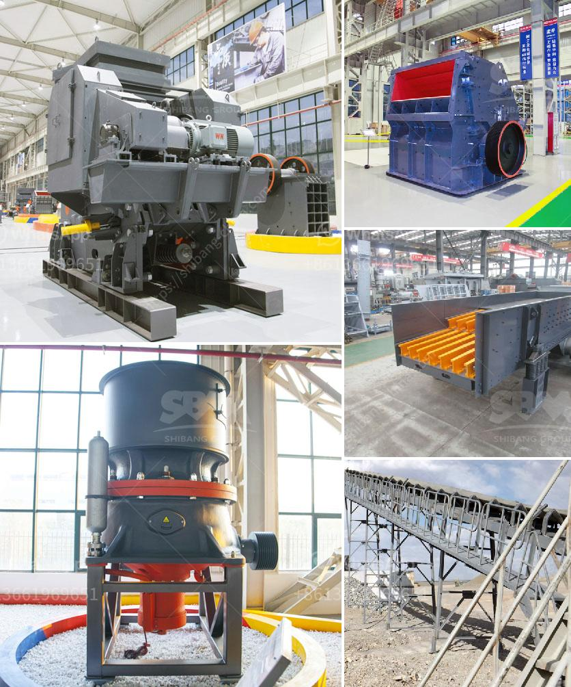

<h3>pe series jaw crusher rate 1000ton per hour</h3>
PE series jaw crusher is commonly known as the European version jaw crusher, which is a new type of crusher developed by our company after years of research and development. It is extremely efficient with its high crushing ratio and high processing capacity per hour.

The PE series jaw crusher can be used to crush different kinds of materials, such as limestone, granite, marble, basalt, river pebbles, iron ore, copper ore, and so on. Whenever it comes to the quality of the final product, the PE series jaw crusher performs exceptionally well. The finished products are in cubic shape without any tension or cracks, which greatly enhances the overall efficiency and ensures the high-quality end result.

With the capacity to crush 1,000 tons of material per hour, the jaw crusher is an invaluable piece of equipment to have on any construction site. It can be used independently or in conjunction with other machinery to form a complete crushing line. It is a versatile and reliable machine that is capable of meeting the crushing requirements of any task.

One of the reasons why the PE series jaw crusher is so popular is because of its superior performance. It has a large crushing ratio and a high processing capacity, which allows it to crush large size materials into smaller pieces. This reduces the overall cost of the project and increases the efficiency of the operation.

Additionally, the PE series jaw crusher is equipped with a deep crushing chamber and optimized design, which enhances the material flow and increases the throughput rate. This means that more material can be processed in a shorter period of time. The jaw crusher also has a wide range of adjustable settings, allowing the operator to easily control the size of the final product.

Furthermore, the PE series jaw crusher is designed with a reliable and durable structure, ensuring its long lifespan and low maintenance costs. It is equipped with high-quality bearings that are capable of withstanding heavy loads, ensuring smooth and efficient operation.

In conclusion, the PE series jaw crusher is a powerful machine that combines superior performance with outstanding durability. Its high processing capacity of 1,000 tons per hour, combined with its ability to crush various materials, makes it an indispensable tool for any construction site. Whether used independently or as part of a larger crushing line, the PE series jaw crusher is sure to deliver impressive results.
<h3>Contact us</h3><ul><li><strong>Whatsapp:&nbsp;<a href="https://wa.me/8613661969651">+8613661969651</a></strong></li><li><a href="https://swt.shibang-china.com/?git&amp;zhl&amp;pe series jaw crusher rate 1000ton per hour"><strong>Online Service(chat now)</strong></a></li></ul><h3>Related</h3><ul><li><a href='how to build a gold washing plant.md'>how to build a gold washing plant</a></li><li><a href='italia dry production line supplier.md'>italia dry production line supplier</a></li><li><a href='vsi crusher manufacturers.md'>vsi crusher manufacturers</a></li><li><a href='difference between raymond mill and vertical roller mill.md'>difference between raymond mill and vertical roller mill</a></li><li><a href='cost of a stone crusher.md'>cost of a stone crusher</a></li></ul>