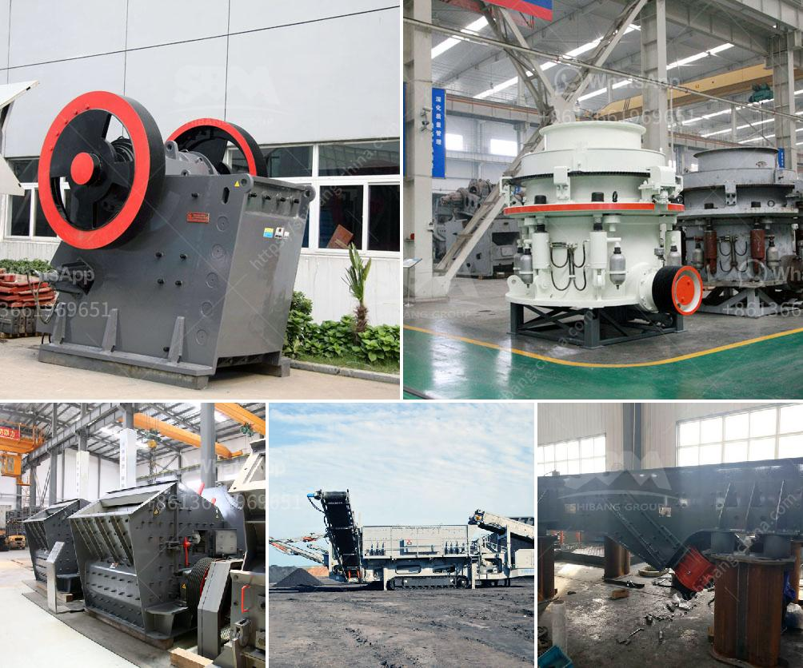

<h3>pebble production line</h3>
Pebbles are small, smooth stones that are often used for various purposes, including landscaping, decoration, and even in the production of concrete. The process of creating pebbles involves a unique and efficient production line that ensures the highest quality results.

The pebble production line starts with the sourcing of the raw materials. Various types of rocks, such as limestone, granite, and basalt, are collected from quarries and then transported to the production facility. These rocks are carefully inspected for their quality and strength before being utilized in the production process.

Once the rocks are selected, they are subjected to a crushing process. In this stage, large rocks are broken down into smaller, more manageable pieces using heavy machinery. This crushing process ensures that the rocks are of a suitable size to be further processed into pebbles.

After the rocks are crushed, they move on to the next stage of the production line, which is called the screening process. In this phase, the crushed rocks are sifted through various screens to separate them into different sizes. This step helps to achieve the desired uniformity and consistency in the final pebble product.

The screened rocks are then meticulously washed to remove any dust, dirt, or impurities. This thorough cleaning process ensures that the pebbles have a clean and polished appearance, making them ideal for decorative purposes.

Once the washing process is complete, the pebbles are dried to eliminate any moisture content. This step is crucial to prevent mold or mildew growth and to maintain the pebbles' quality.

Finally, the dried pebbles are carefully packed and prepared for distribution. They are sorted based on size and quality, ensuring that customers receive pebbles that meet their specific requirements.

In conclusion, the pebble production line is a well-organized and efficient process that turns raw rocks into beautifully polished pebbles. From sourcing the raw materials to the final packaging, every step is carefully executed to ensure a high-quality product. Whether used for landscaping or decorative purposes, pebbles add a touch of elegance and natural beauty to any space.
<h3>Contact us</h3><ul><li><strong>Whatsapp:&nbsp;<a href="https://wa.me/8613661969651">+8613661969651</a></strong></li><li><a href="https://swt.shibang-china.com/?git&amp;zhl&amp;pebble production line"><strong>Online Service(chat now)</strong></a></li></ul><h3>Related</h3><ul><li><a href='picture of complete of quarry crushing plant nigeria.md'>picture of complete of quarry crushing plant nigeria</a></li><li><a href='small mobile diesel engine double rolls crusher.md'>small mobile diesel engine double rolls crusher</a></li><li><a href='metal conveyor belts malaysia.md'>metal conveyor belts malaysia</a></li><li><a href='methods of hammer mill.md'>methods of hammer mill</a></li><li><a href='jaw crusher for sale in usa.md'>jaw crusher for sale in usa</a></li></ul>