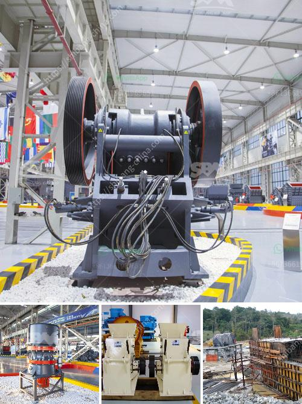

<h3>pf series impact crusher</h3>
The PF series impact crusher, also known as the PF impact crusher or horizontal shaft impact crusher, is one of the most commonly used stone crushing equipment in mining, quarry and construction industries. This series impact crusher is designed to crush hard rocks and recycle materials with higher efficiency and lower costs.

Compared to other types of crushing equipment, the PF series impact crusher achieves a higher reduction ratio and can crush materials with even granularity. It has a wide range of applications, such as mining, metallurgy, construction, highway, and railway industries. It can crush various materials, including concrete, limestone, granite, basalt, river pebbles, etc.

The unique design of the PF series impact crusher enables it to produce excellent particle shape, which is highly desired in the construction industry. It uses impact energy to crush the materials, and the rotor rotates at a high speed. The materials are crushed in the first crushing chamber and then crushed again in the second crushing chamber. The final product is discharged from the discharge port at the bottom of the machine.

In addition to its excellent performance, the PF series impact crusher is also highly durable and easy to maintain. It is equipped with a high-chrome hammer, impact plate, and wear-resistant liner, which significantly extend its service life. Furthermore, the machine is equipped with a hydraulic system that allows easy adjustment of the gap between the impact plate and the hammer, ensuring the desired particle size.

Overall, the PF series impact crusher is a cost-effective choice for processing hard rocks and recycling materials. Its simple structure, high crushing efficiency, and reliable performance make it an ideal choice for primary and secondary crushing applications. Whether in quarrying, mining, or construction, this impact crusher will surely deliver high-quality and consistent results.
<h3>Contact us</h3><ul><li><strong>Whatsapp:&nbsp;<a href="https://wa.me/8613661969651">+8613661969651</a></strong></li><li><a href="https://swt.shibang-china.com/?git&amp;zhl&amp;pf series impact crusher"><strong>Online Service(chat now)</strong></a></li></ul><h3>Related</h3><ul><li><a href='how does a quarry operate complete crushing palnt.md'>how does a quarry operate complete crushing palnt</a></li><li><a href='gold ore processing equipment manufacturer india.md'>gold ore processing equipment manufacturer india</a></li><li><a href='jaw crushers suppliers.md'>jaw crushers suppliers</a></li><li><a href='crushing plant for aggregate india.md'>crushing plant for aggregate india</a></li><li><a href='set up a quarry business.md'>set up a quarry business</a></li></ul>