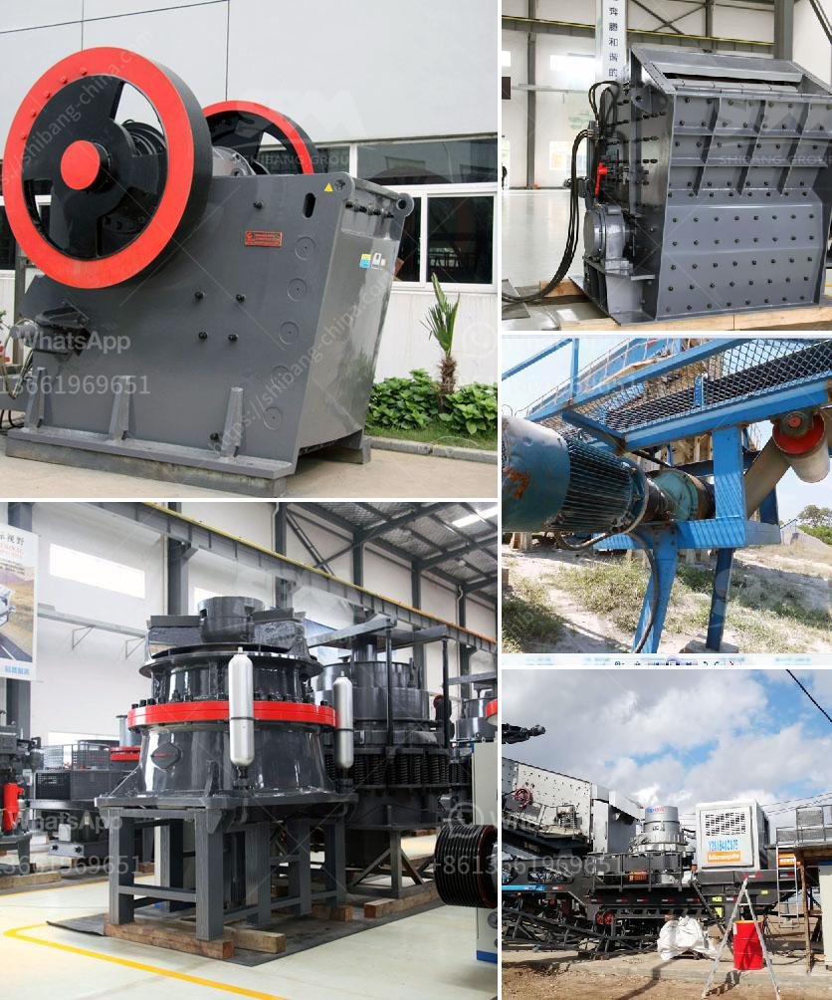

<h3>philippine crushing machine</h3>
In recent years, the Philippine construction industry has experienced remarkable growth due to government infrastructure projects and private investments. As a result, the demand for construction materials has soared, leading to an increased need for efficient and reliable crushing machines. This article explores the importance of crushing machines in the Philippine market, their key advantages, and the impact they have on the construction industry.

Crushing machines are devices designed to reduce large rocks into smaller, more manageable sizes, making them ideal for the construction industry. They play a crucial role in the process of producing aggregates, which are essential in the production of concrete, asphalt, and other construction materials. The need for high-quality aggregates has become paramount as the demand for durable infrastructure projects continues to rise across the country.

1. Increased Efficiency: Crushing machines offer automated and efficient processing of raw materials, reducing the labor-intensive process of manually breaking rocks into smaller pieces. These machines can handle large volumes of material and produce consistent output, saving time and expenditure.

2. Versatility: Philippine crushing machines are versatile and can handle various types of materials, such as granite, limestone, sandstone, and concrete. Their adaptability allows construction companies to use them across multiple projects, ensuring maximum return on investment.

3. Cost-effectiveness: Investing in crushing machines allows construction companies to produce aggregates on-site, eliminating transportation and logistics costs. By reducing the reliance on external suppliers, companies have greater control over quality and can respond quickly to project demands, leading to cost savings and increased profitability.

4. Environmental Sustainability: Crushing machines equipped with advanced dust suppression systems and noise reduction technology help minimize the environmental impact of quarrying activities. This compliance with environmental regulations is crucial in an era where sustainability and environmental protection are given more importance.

The availability of reliable crushing machines has contributed significantly to the growth of the Philippine construction industry. Construction companies can now complete projects faster and more efficiently, meeting deadlines while ensuring high-quality standards. Moreover, the use of on-site crushing machines reduces the need for importing aggregates, bolstering domestic supply chains and reducing dependence on foreign imports.

Furthermore, the rise of the crushing machine industry has created employment opportunities, benefiting both skilled and unskilled workers. As demand increases, manufacturers are expanding their operations, creating jobs and boosting local economies.

The Philippine construction industry's increasing demand for crushing machines highlights the sector's progress and potential. These machines offer various advantages, from increased efficiency and cost-effectiveness to environmental sustainability. Their crucial role in the production of aggregates has become indispensable to meet the growing infrastructure requirements. With continued technological advancements and regulatory compliance, the crushing machine industry is set to thrive, contributing to the overall development of the Philippine construction sector.
<h3>Contact us</h3><ul><li><strong>Whatsapp:&nbsp;<a href="https://wa.me/8613661969651">+8613661969651</a></strong></li><li><a href="https://swt.shibang-china.com/?git&amp;zhl&amp;philippine crushing machine"><strong>Online Service(chat now)</strong></a></li></ul><h3>Related</h3><ul><li><a href='crushing plant for irion ore.md'>crushing plant for irion ore</a></li><li><a href='ball mill in zimbabwe for sale.md'>ball mill in zimbabwe for sale</a></li><li><a href='grinding mills for sale johannesburg.md'>grinding mills for sale johannesburg</a></li><li><a href='cement factory for sale in andra pradesh.md'>cement factory for sale in andra pradesh</a></li><li><a href='gypsum machinery plant from france.md'>gypsum machinery plant from france</a></li></ul>