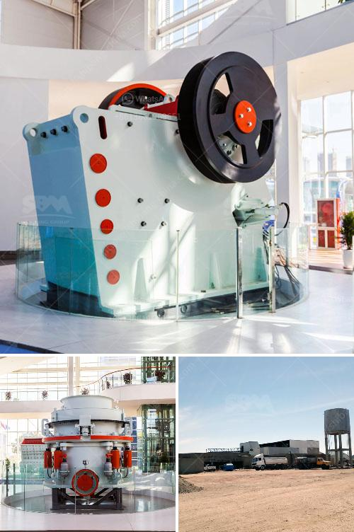

<h3>philippines kenya stone crusher</h3>
The Philippines and Kenya are two countries with immense potential in mineral resources. They are rich in natural reserves of limestone, which is used as a building material, and aggregate, commonly used for road construction.

To maximize the utilization of these resources, both countries have embraced the use of stone crushers. A stone crusher is a machine that reduces rocks into smaller pieces or dust. It is commonly used for agricultural, industrial, and construction purposes.

In the Philippines, a stone crusher is an essential equipment to process limestone. As the country's rich limestone deposits can be found in many provinces, especially in the Visayas and Mindanao areas, stone crushers are needed in these areas to break down the larger rocks into smaller sizes for further processing. The crushed limestone can be used as a base material for roads, sidewalks, and concrete structures.

Similarly, in Kenya, stone crushers have played a crucial role in the construction industry. The country has extensive limestone deposits, primarily found in the Rift Valley and Eastern regions. Stone crushers are used to crush the limestone into smaller sizes, which are then used as aggregate in road construction, building foundations, and concrete production.

The demand for stone crushers in both countries is steadily increasing due to the booming construction industry. The governments of the Philippines and Kenya understand the significance of stone crushers in their respective countries' economic growth. They have implemented policies and regulations to ensure responsible and sustainable mining practices.

Furthermore, stone crushers are also being used in the agricultural sector in both countries. The crushed limestone or aggregate is used as a soil conditioner to improve the soil's fertility and pH levels. It helps in enhancing crop productivity and maximizing agricultural yields.

In conclusion, stone crushers have proven to be invaluable machines in the construction and agricultural industries of the Philippines and Kenya. With their ability to break down larger rocks into smaller sizes, stone crushers have become an essential equipment for processing limestone and aggregate. As both countries continue to experience economic growth and development, the demand for stone crushers will likely continue to rise. By ensuring responsible and sustainable mining practices, the Philippines and Kenya can harness the full potential of their mineral resources and contribute to their respective nations' progress.
<h3>Contact us</h3><ul><li><strong>Whatsapp:&nbsp;<a href="https://wa.me/8613661969651">+8613661969651</a></strong></li><li><a href="https://swt.shibang-china.com/?git&amp;zhl&amp;philippines kenya stone crusher"><strong>Online Service(chat now)</strong></a></li></ul><h3>Related</h3><ul><li><a href='cost to setup cement plant industry.md'>cost to setup cement plant industry</a></li><li><a href='gypsum production line in spain for sale.md'>gypsum production line in spain for sale</a></li><li><a href='hydraulic system loesche mill.md'>hydraulic system loesche mill</a></li><li><a href='cement mill startup procedures.md'>cement mill startup procedures</a></li><li><a href='crushed stone plant peru.md'>crushed stone plant peru</a></li></ul>