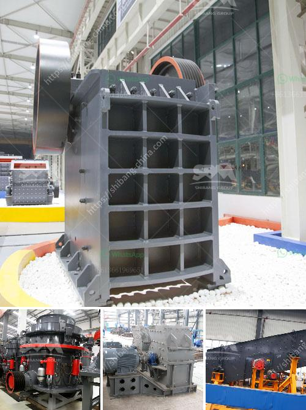

<h3>philippines mining equipment companies</h3>
The Philippines, known for its rich biodiversity and stunning landscapes, has a promising mining industry. In recent years, the government has been actively promoting responsible and sustainable mining practices to protect the environment and support local communities. This has opened up opportunities for mining equipment companies to provide the necessary tools and machinery for this sector.

One of the leading mining equipment companies in the Philippines is Globequip. Founded in 2004, Globequip provides high-quality and reliable mining equipment to both small-scale and large-scale mining operations. They offer a wide range of equipment, including excavators, bulldozers, loaders, crushers, and drilling machines. With a strong commitment to customer satisfaction and after-sales support, Globequip has built a solid reputation in the industry.

Another prominent player in the Philippine mining equipment market is Equipco. Established in 1982, Equipco has been supplying mining equipment to various mining companies across the country. They specialize in earthmoving equipment, such as excavators, loaders, and bulldozers, as well as crushing and screening equipment. Equipco aims to provide innovative and efficient solutions to help mining companies boost productivity and reduce operational costs.

Apart from large-scale mining equipment companies, there are also several local Filipino equipment manufacturers catering to the needs of small-scale miners. These companies, such as FTA Mares, Montalban Millex, and Falcon Mining, produce specialized equipment for gold panning, digging, and processing. Their equipment is designed to be compact, portable, and easy to operate, making it ideal for small-scale miners who usually work in remote and hard-to-reach areas.

However, the mining equipment market in the Philippines is not without its challenges. While the government has made efforts to improve mining regulations and environmental standards, illegal mining activities still persist, especially in remote areas. Illegal miners often use rudimentary equipment, causing environmental damage and safety risks. To combat this issue, the government and mining equipment companies are collaborating to create more awareness and provide support to small-scale miners.

Furthermore, the ongoing COVID-19 pandemic has also affected the mining equipment industry in the Philippines. The lockdowns and travel restrictions imposed to contain the virus have disrupted supply chains and delayed equipment deliveries. However, mining companies and equipment manufacturers have adapted to the new normal by implementing safety protocols and utilizing technology to conduct remote equipment inspections and maintenance.

In conclusion, the Philippines mining equipment market offers significant opportunities for both local and international companies. With its vast mineral resources and government support for responsible mining practices, the demand for mining equipment is expected to grow. As the industry navigates challenges like illegal mining and the COVID-19 pandemic, mining equipment companies need to continuously innovate and provide sustainable solutions to support the growth of the Philippine mining sector.
<h3>Contact us</h3><ul><li><strong>Whatsapp:&nbsp;<a href="https://wa.me/8613661969651">+8613661969651</a></strong></li><li><a href="https://swt.shibang-china.com/?git&amp;zhl&amp;philippines mining equipment companies"><strong>Online Service(chat now)</strong></a></li></ul><h3>Related</h3><ul><li><a href='grinder rock crusher.md'>grinder rock crusher</a></li><li><a href='granite quarry companies in europe.md'>granite quarry companies in europe</a></li><li><a href='stone crusher in jos plateau state nigeria.md'>stone crusher in jos plateau state nigeria</a></li><li><a href='300kg to 500kg ball mill.md'>300kg to 500kg ball mill</a></li><li><a href='mobile crushing price uk.md'>mobile crushing price uk</a></li></ul>