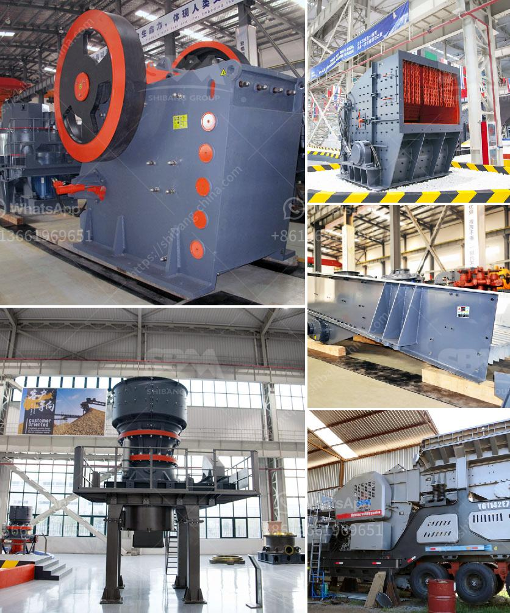

<h3>philippines second hand stone crusher</h3>
Second-hand stone crusher is a crucial piece of equipment for many construction and mining companies. They are utilized for various purposes depending on the type of crusher and its use. Some companies also use this crusher to process large rocks and stones into smaller pieces that can be used in construction material production, cement manufacturing, and other similar industries.

The Philippines has a wealth of natural resources, especially mineral deposits such as granite, marble, and sandstone. Therefore, it is no surprise that the demand for second-hand stone crushers is also high. However, finding high-quality second-hand stone crushers in the Philippines can be a daunting task for many buyers.

One of the main reasons why it is challenging to find second-hand stone crushers is the limited availability of these machines in the market. Due to the increasing demand for construction materials and the booming construction industry in the Philippines, many companies keep their stone crushers in operation for a more extended period or sell them quickly at high prices.

Another hurdle faced by buyers in the Philippines is the lack of proper information and knowledge when buying second-hand stone crushers. It is crucial to understand the machine's condition, its performance, and the degree of wear and tear before making a purchase.

Here are some factors that buyers should consider when purchasing a second-hand stone crusher in the Philippines:

1. Research and background check: Check the reputation and credibility of the seller or dealer. Look for testimonials, reviews, and feedback from previous customers. It is also advisable to visit the seller's location and inspect the stone crusher personally to assess its condition accurately.

2. Maintenance history: Request the maintenance and service records of the crusher. A machine that has been well-maintained will have a longer lifespan and better performance.

3. Physical inspection: If possible, before finalizing the deal, inspect the stone crusher's critical components, such as the engine, hopper, conveyor belts, and crushing mechanism. Ensure that all the parts are in good working condition and free from any damage.

4. Performance test: Ask for a demo or performance test to determine the crusher's efficiency and productivity. This will help gauge if the machine can meet your production requirements.

5. Spare parts availability: Enquire about the availability of spare parts for the specific make and model of the crusher. Ensure that spare parts are readily accessible in the Philippines or can be easily sourced from reputable suppliers.

6. Price and Negotiation: Compare prices from different sellers and negotiate for the best deal. Be cautious of sellers offering unusually low prices, as this may indicate underlying issues with the machine.

By considering these factors, buyers can increase their chances of finding and procuring a reliable second-hand stone crusher in the Philippines. Remember that investing in a quality machine will save money in the long run, as it will require fewer repairs and replacements.

In conclusion, the demand for second-hand stone crushers in the Philippines is high due to the country's rich mineral resources and booming construction industry. However, buyers must exercise caution when purchasing these machines. Thorough research, proper inspection, and evaluation of the machine's condition are necessary to ensure a successful purchase. With the right investment, these stone crushers can greatly contribute to the growth of the construction and mining sectors in the Philippines.
<h3>Contact us</h3><ul><li><strong>Whatsapp:&nbsp;<a href="https://wa.me/8613661969651">+8613661969651</a></strong></li><li><a href="https://swt.shibang-china.com/?git&amp;zhl&amp;philippines second hand stone crusher"><strong>Online Service(chat now)</strong></a></li></ul><h3>Related</h3><ul><li><a href='ball mill in zimbabwe for sale.md'>ball mill in zimbabwe for sale</a></li><li><a href='cost or operating stone quarry and crusher.md'>cost or operating stone quarry and crusher</a></li><li><a href='portable sand screening machine philippines.md'>portable sand screening machine philippines</a></li><li><a href='kohinoor stone crusher contact.md'>kohinoor stone crusher contact</a></li><li><a href='advances in hammer mills.md'>advances in hammer mills</a></li></ul>