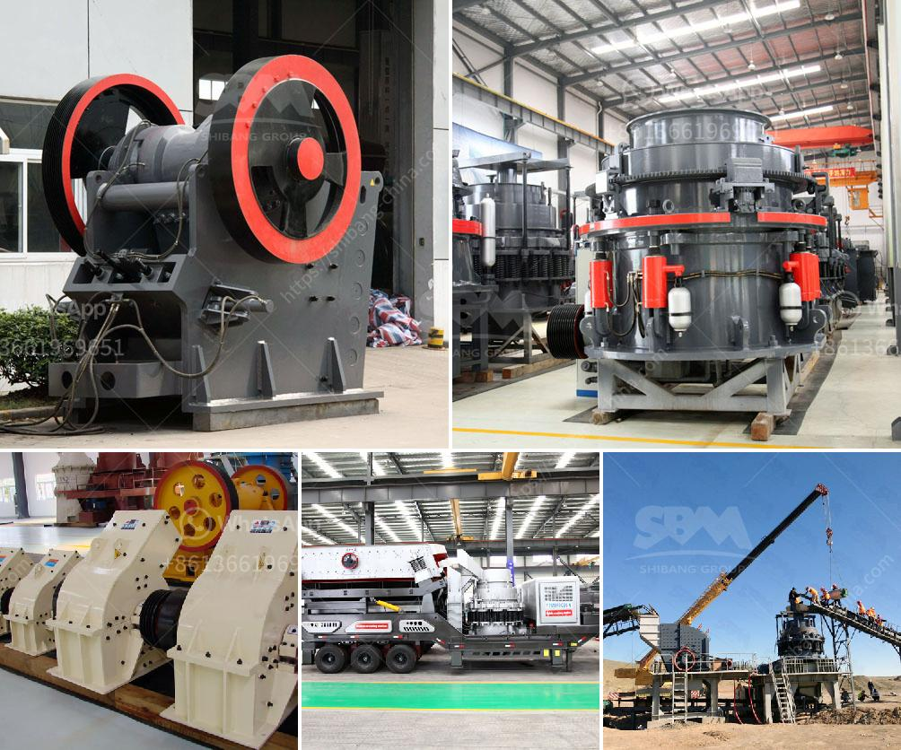

<h3>picture of complete of quarry crushing plant nigeria</h3>
Quarry crushing plant is a key process in the quarry operation. Quarrying activities include extraction, quarry development, and material handling stages. Quarry crushing plant operation is essential in granite quarrying project. With the rising granite crushed stone crusher and mining equipment and processing technology, greatly expanding the application fields of granite.

The quarry crusher plant is used for crushing and grinding rocks and stones for construction purposes. The typical configuration of the plant includes a primary crusher, vibrating screen, and belt conveyor. The primary crushing stage is the most economical operation of the aggregate plant in which to make material reduction, after initial blasting in the quarry.

In Nigeria, quarry crushing plant is designed with advanced technology and can be equipped with different types of crushers, such as jaw crusher, impact crusher, cone crusher, and gyratory crusher, etc. According to the requirements of final size, we can choose the right crushing machine to optimize the quarry crushing plant.

The quarry crushing plant is built in a lush green landscape with ample open space, displaying beautiful views of the surrounding area. The high-quality crushed stones produced in the quarry are used for several construction purposes like road construction, building construction, and concrete production. These crushed stones are also exported to neighboring countries, adding to the foreign revenue of the nation.

With the growing construction industry in Nigeria, the demand for high-quality crushed stones is on the rise. The quarry crusher plant showcased in this photograph is an excellent example of how a quarrying operation can be built in a sustainable and eco-friendly manner, while still meeting the increasing demands of the construction industry. Expanding the application fields of granite and improving the technology for extracting granite is crucial to meet the growing infrastructure needs of Nigeria and contribute to its overall economic development.
<h3>Contact us</h3><ul><li><strong>Whatsapp:&nbsp;<a href="https://wa.me/8613661969651">+8613661969651</a></strong></li><li><a href="https://swt.shibang-china.com/?git&amp;zhl&amp;picture of complete of quarry crushing plant nigeria"><strong>Online Service(chat now)</strong></a></li></ul><h3>Related</h3><ul><li><a href='super fine powder grinder.md'>super fine powder grinder</a></li><li><a href='used stone crusher plant for sale in uk.md'>used stone crusher plant for sale in uk</a></li><li><a href='crusher plant in construction.md'>crusher plant in construction</a></li><li><a href='artificial sand making from sandstone.md'>artificial sand making from sandstone</a></li><li><a href='crusher cost stone crusher peru cost.md'>crusher cost stone crusher peru cost</a></li></ul>